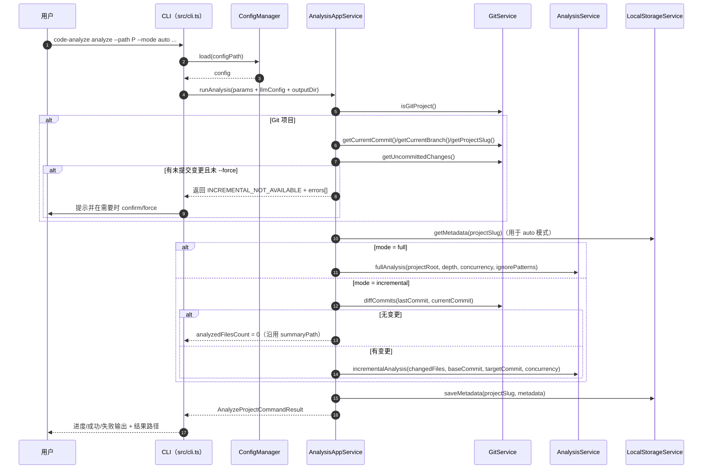
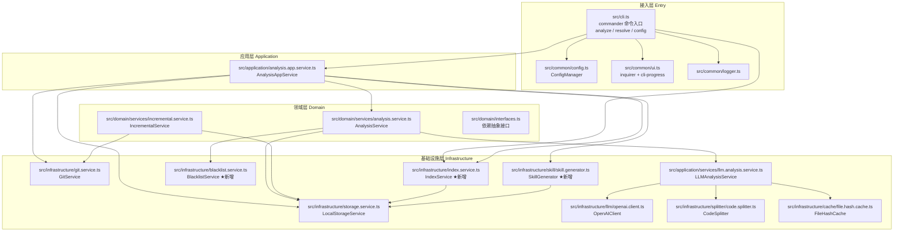
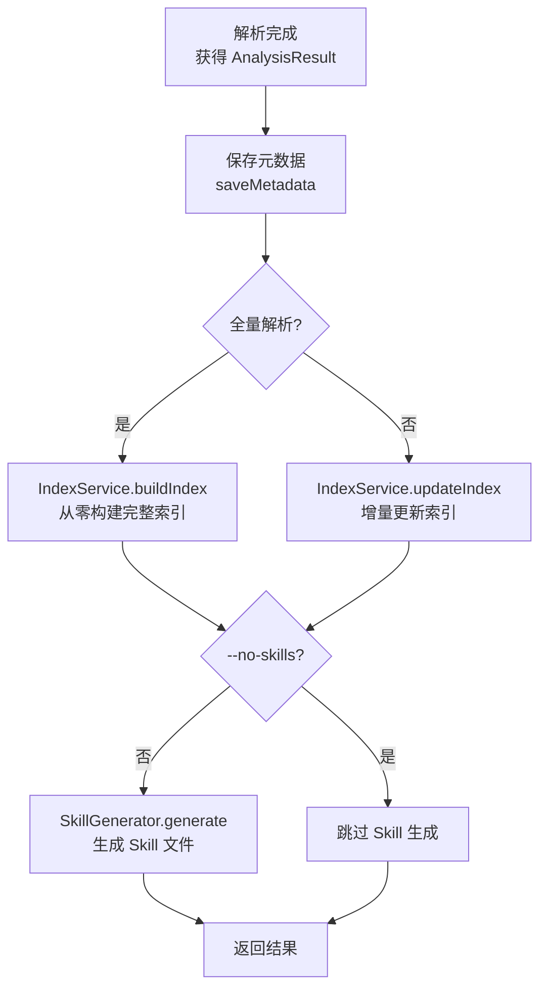
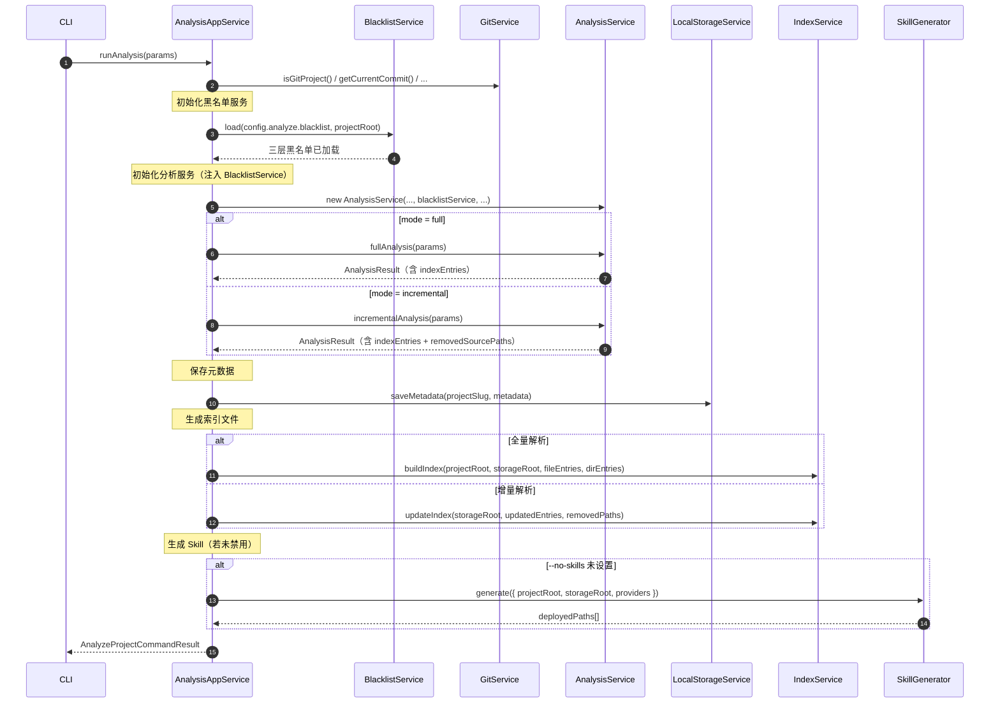
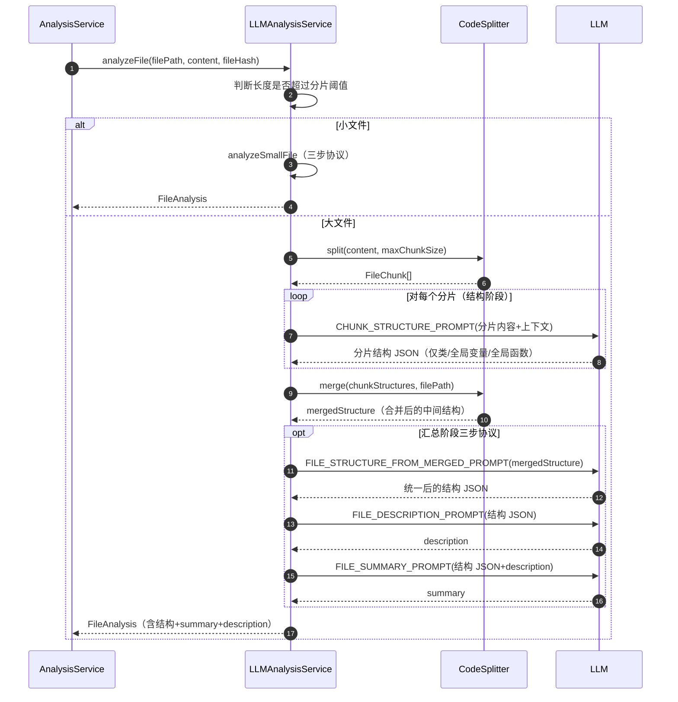
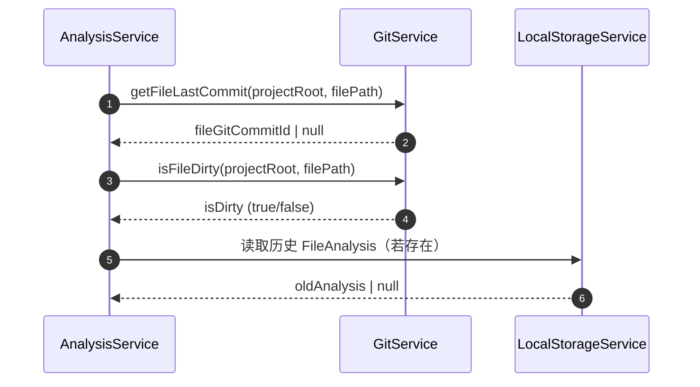

# OpenCode大型项目代码理解（本地CLI版）软件设计文档（以当前实现为准）

> 本文档严格对齐仓库当前代码实现（以 `src/` 下代码为准），用于描述“项目代码理解/分析”工具的模块划分、接口契约、数据结构、关键流程与可视化图（架构图/流程图）。

## 1. 目标与范围

- **目标**：对给定目录/单文件进行“结构化代码理解”，输出 Markdown 报告（文件级/目录级/项目级），并支持 Git 增量模式与 LLM 解析（含缓存与大文件分片）。
- **运行形态**：本地 CLI（入口 `src/cli.ts`），核心能力集中在 `Application/Domain/Infrastructure/Common` 四层。
- **输出形态**：在项目目录下（默认 `./.code-analyze-result`）生成：
  - `PROJECT_SUMMARY.md`（项目总结）
  - `.analysis_metadata.json`（元数据）
  - `<dir>/index.md`（目录聚合）
  - `<dir>/<file>.md`（文件分析）

## 2. 总体架构（六边形/分层）

### 2.1 分层与依赖规则

- **接入层（Ports / Entry）**：CLI 命令解析、交互（确认/选择/进度条）、配置加载与合并。
  - 代表文件：`src/cli.ts`、`src/common/config.ts`、`src/common/ui.ts`
- **应用层（Application）**：编排一次“分析任务”的业务流程，决定 full/incremental/auto 分支，处理 Git 状态与元数据写入。
  - 代表文件：`src/application/analysis.app.service.ts`
- **领域层（Domain）**：核心分析逻辑（遍历/增量策略）、对外依赖的抽象接口（Git/Storage/LLM/Cache/WorkerPool 等）。
  - 代表文件：`src/domain/interfaces.ts`、`src/domain/services/analysis.service.ts`、`src/domain/services/incremental.service.ts`
- **基础设施层（Infrastructure）**：Git/本地存储/LLM 客户端/分片器/缓存/WorkerPool 的具体实现。
  - 代表文件：`src/infrastructure/git.service.ts`、`src/infrastructure/storage.service.ts`、`src/infrastructure/llm/openai.client.ts`、`src/infrastructure/splitter/code.splitter.ts`、`src/infrastructure/cache/file.hash.cache.ts`、`src/infrastructure/worker-pool/*`
- **公共层（Common）**：常量、错误码、类型定义、路径/slug 工具、日志。
  - 代表文件：`src/common/types.ts`、`src/common/errors.ts`、`src/common/constants.ts`、`src/common/utils.ts`、`src/common/logger.ts`

### 2.2 架构图（模块关系）

```mermaid
flowchart TB
  subgraph Entry[接入层 Entry]
    CLI[src/cli.ts<br/>commander 命令入口]
    CFG[src/common/config.ts<br/>ConfigManager]
    UI[src/common/ui.ts<br/>inquirer + cli-progress]
    LOG[src/common/logger.ts]
  end

  subgraph App[应用层 Application]
    AAS[src/application/analysis.app.service.ts<br/>AnalysisAppService]
  end

  subgraph Domain[领域层 Domain]
    AS[src/domain/services/analysis.service.ts<br/>AnalysisService]
    INC[src/domain/services/incremental.service.ts<br/>IncrementalService]
    IF[src/domain/interfaces.ts<br/>依赖抽象接口]
  end

  subgraph Infra[基础设施层 Infrastructure]
    GIT[src/infrastructure/git.service.ts<br/>GitService]
    STORE[src/infrastructure/storage.service.ts<br/>LocalStorageService]
    LLMCLI[src/infrastructure/llm/openai.client.ts<br/>OpenAIClient]
    SPLIT[src/infrastructure/splitter/code.splitter.ts<br/>CodeSplitter]
    CACHE[src/infrastructure/cache/file.hash.cache.ts<br/>FileHashCache]
    LLMAS[src/application/services/llm.analysis.service.ts<br/>LLMAnalysisService]
    WP[src/infrastructure/worker-pool/worker-pool.service.ts<br/>WorkerPoolService<br/>(线程池：用于文件解析与目录聚合的并发消费)]
  end

  CLI --> CFG
  CLI --> UI
  CLI --> LOG
  CLI --> AAS

  AAS --> GIT
  AAS --> STORE
  AAS --> AS

  AS --> STORE
  AS --> LLMAS
  LLMAS --> LLMCLI
  LLMAS --> SPLIT
  LLMAS --> CACHE

  INC --> GIT
  INC --> STORE
```

## 3. 对外接口（CLI）

### 3.1 顶层命令

- **命令名**：`code-analyze`（别名：`ca`）
- **全局选项**（`src/cli.ts`）：
  - `-c, --config <path>`：配置文件路径（默认 `~/.config/code-analyze/config.yaml`）
  - `-o, --output <format>`：输出格式 `text | json | markdown`（当前主要影响 `query/config` 输出；`analyze` 结果以落盘为主）
  - `--log-level <level>`：日志级别 `debug | info | warn | error`

### 3.2 `analyze` 子命令

- **用途**：执行项目/目录/单文件的分析与报告生成
- **选项**：
  - `-p, --path <path>`：项目根路径（默认 `process.cwd()`）
  - `-m, --mode <mode>`：`full | incremental | auto`（默认 `auto`）
  - `-d, --depth <number>`：遍历深度（默认 `-1` 表示不限制；仅当 `depth >= 1` 时启用限制）
  - `-C, --concurrency <number>`：并发数（未传时使用配置 `analyze.default_concurrency`；若传入则覆盖配置）
  - `--output-dir <path>`：结果输出目录（默认来自配置 `global.output_dir`）
  - `--no-confirm`：跳过交互确认
  - `--force`：强制执行（用于 Git 未提交变更场景）
  - **LLM 相关**：
    - `--llm-base-url <url>`
    - `--llm-api-key <key>`
    - `--llm-model <model>`
    - `--llm-temperature <number>`
    - `--llm-max-tokens <number>`
    - `--llm-timeout <ms>`
    - `--llm-max-retries <number>`
    - `--llm-retry-delay <ms>`
    - `--llm-context-window-size <number>`
    - `--no-llm-cache`
    - `--llm-cache-dir <path>`
    - `--clear-cache`

### 3.3 `query` 子命令

- **用途**：查询某个文件/目录的分析结果并以 `text/json/markdown` 输出到终端
- **参数/选项**：
  - `<query-path>`：相对项目根的路径
  - `-t, --type <type>`：`summary | full | diagram`
  - `-p, --project <path>`：项目根路径（默认 `process.cwd()`）
  - `--output-dir <path>`：结果输出目录
- **实现状态**：`LocalStorageService.getFileAnalysis/getDirectoryAnalysis` 当前为 `TODO`（返回 `null`），因此 `query` 命令在当前实现下会提示“未找到解析结果”。

### 3.4 `config` 子命令

- **用途**：管理配置文件（列出/获取/设置/重置）
- **选项**：
  - `--list`
  - `--get <key>`
  - `--set <key>=<value>`
  - `--reset`

## 4. 配置系统（默认→文件→环境变量）

### 4.1 配置文件位置与扩展

- **默认路径**：`~/.config/code-analyze/config.yaml`
- **`~` 展开规则**：若以 `~` 开头则展开为 `HOME`/`USERPROFILE`/`os.homedir()`

### 4.2 三层配置加载流程

```mermaid
flowchart TD
  A[启动 CLI] --> B[ConfigManager.load(customPath?)]
  B --> C[1) 生成默认配置 ConfigSchema.parse({})]
  C --> D{2) 配置文件存在?}
  D -- 是 --> E[读取 YAML 并校验/merge]
  D -- 否 --> F[自动生成默认 config.yaml]
  E --> G[3) 扫描环境变量 CODE_ANALYZE_*]
  F --> G
  G --> H[ConfigSchema.parse(default+file+env)]
  H --> I[返回 config]
```

### 4.3 环境变量映射（摘取关键）

- `CODE_ANALYZE_LOG_LEVEL` → `global.log_level`
- `CODE_ANALYZE_OUTPUT_FORMAT` → `global.output_format`
- `CODE_ANALYZE_AUTO_CONFIRM` → `global.auto_confirm`
- `CODE_ANALYZE_OUTPUT_DIR` → `global.output_dir`
- `CODE_ANALYZE_LLM_BASE_URL` → `llm.base_url`
- `CODE_ANALYZE_LLM_API_KEY` → `llm.api_key`
- `CODE_ANALYZE_LLM_MODEL` → `llm.model`
- `CODE_ANALYZE_LLM_CONTEXT_WINDOW_SIZE` → `llm.context_window_size`
- `CODE_ANALYZE_LLM_CACHE_ENABLED` → `llm.cache_enabled`
- `CODE_ANALYZE_LLM_CACHE_DIR` → `llm.cache_dir`

## 5. 领域接口定义（Domain Interfaces）

> 以下接口定义来源：`src/domain/interfaces.ts`（接口名/参数与返回值对齐实现）

### 5.1 分析服务接口 `IAnalysisService`

```typescript
export interface IAnalysisService {
  fullAnalysis(params: FullAnalysisParams): Promise<AnalysisResult>
  incrementalAnalysis(params: IncrementalAnalysisParams): Promise<AnalysisResult>
  resumeAnalysis(params: ResumeAnalysisParams): Promise<AnalysisResult>
}
```

### 5.2 增量服务接口 `IIncrementalService`

```typescript
export interface IIncrementalService {
  canDoIncremental(projectRoot: string): Promise<{ available: boolean; baseCommit?: string; reason?: string }>
  getChangedFiles(projectRoot: string, baseCommit: string, targetCommit: string): Promise<string[]>
  findNearestCommonAncestor(projectRoot: string, commits: string[]): Promise<string | null>
  getAffectedDirectories(changedFiles: string[]): string[]
}
```

### 5.3 存储接口 `IStorageService`

```typescript
export interface IStorageService {
  saveFileAnalysis(projectSlug: string, filePath: string, data: FileAnalysis): Promise<void>
  saveDirectoryAnalysis(projectSlug: string, dirPath: string, data: DirectoryAnalysis): Promise<void>
  saveProjectSummary(projectSlug: string, data: ProjectSummary): Promise<void>
  saveMetadata(projectSlug: string, metadata: AnalysisMetadata): Promise<void>
  saveModificationLog(projectSlug: string, logs: ModificationLog[]): Promise<void>

  getFileAnalysis(projectSlug: string, filePath: string, type: 'summary' | 'full' | 'diagram'): Promise<FileAnalysis | null>
  getDirectoryAnalysis(projectSlug: string, dirPath: string, type: 'summary' | 'full' | 'diagram'): Promise<DirectoryAnalysis | null>
  getMetadata(projectSlug: string): Promise<AnalysisMetadata | null>
  getCheckpoint(projectSlug: string): Promise<AnalysisCheckpoint | null>
  saveCheckpoint(projectSlug: string, checkpoint: AnalysisCheckpoint): Promise<void>
  getStoragePath(projectSlug: string): string
  getProjectSummary(projectSlug: string): Promise<ProjectSummary | null>
}
```

### 5.4 Git 接口 `IGitService`

```typescript
export interface IGitService {
  isGitProject(projectRoot: string): Promise<boolean>
  getCurrentCommit(projectRoot: string): Promise<string>
  getCurrentBranch(projectRoot: string): Promise<string>
  getProjectSlug(projectRoot: string): Promise<string>
  getUncommittedChanges(projectRoot: string): Promise<string[]>
  diffCommits(projectRoot: string, commit1: string, commit2: string): Promise<string[]>
}
```

### 5.5 WorkerPool 接口 `IWorkerPoolService`（V2.6：主流程已切换为线程池 + 预排序任务队列）

```typescript
export interface IWorkerPoolService {
  submitFileAnalysisTask(filePath: string, fileContent: string, fileHash: string, language?: string): Promise<FileAnalysis>
  submitDirectoryAggregationTask(
    dirPath: string,
    payload: {
      childrenDirs: Array<{ name: string; summary: string; description?: string }>
      childrenFiles: Array<{ name: string; summary: string; description?: string }>
    }
  ): Promise<{ description: string; summary: string }>
  submitValidationTask(parentResult: DirectoryAnalysis, childResult: FileAnalysis | DirectoryAnalysis): Promise<{ valid: boolean; corrections?: Partial<FileAnalysis | DirectoryAnalysis>; log?: ModificationLog }>
  setConcurrency(concurrency: number): void
  waitAll(): Promise<void>
  cancelAll(): void
}
```

### 5.6 LLM/分片/缓存接口

```typescript
export interface ILLMClient {
  call(prompt: string, options?: LLMCallOptions): Promise<LLMResponse>
  batchCall(prompts: string[], options?: LLMCallOptions): Promise<LLMResponse[]>
}

export interface IFileSplitter {
  split(fileContent: string, maxChunkSize: number): Promise<FileChunk[]>
  merge(chunks: FileChunkAnalysis[], filePath: string): Promise<FileAnalysis>
}

export interface IAnalysisCache {
  get(fileHash: string): Promise<FileAnalysis | null>
  set(fileHash: string, result: FileAnalysis): Promise<void>
  clear(fileHash?: string): Promise<void>
}
```

## 6. 核心数据结构（Common Types）

> 数据结构统一定义在：`src/common/types.ts`（本文只列出要点）

- **文件分析**：`FileAnalysis`
- **目录分析**：`DirectoryAnalysis`
- **项目总结**：`ProjectSummary`
- **元数据**：`AnalysisMetadata`
- **断点**：`AnalysisCheckpoint`（当前 `resumeAnalysis()` 仍为 TODO）
- **LLM 配置**：`LLMConfig`

## 7. 核心流程设计（流程图 + 关键细节）

### 7.1 `analyze` 总流程（CLI → 应用层 → 领域层）



### 7.2 全量分析 `AnalysisService.fullAnalysis()`（预扫描 → 任务队列 → 线程池消费）

**关键规则**

- **忽略规则**：由 `BlacklistService` 统一负责，来源为配置项 `analyze.blacklist`（默认黑名单）+ 项目根目录 `.gitignore`（使用 `ignore` 库）；同时在遍历阶段**强制跳过**结果输出目录与内部状态目录：
  - `.code-analyze-result/`
  - `.code-analyze-internal/`
- **深度规则**：`depth === -1` 或未传 → 不限制；仅当 `depth >= 1` 时，`currentDepth > depth` 返回“超出深度限制”的占位目录结果
- **并发模型（V2.6 现行实现）**：
  - **第 1 阶段（预扫描）**：一次性扫描工程目录，生成“全量任务图”：
    - **文件解析任务**：叶子节点，依赖为空；
    - **目录聚合任务**：依赖其直接子文件与子目录的“解析/聚合结果”。
  - **第 2 阶段（预排序队列）**：对任务图做**叶子优先的拓扑序**排序，形成一个在流程开始时就确定的任务队列：
    - 先排所有文件任务（按相对路径字典序稳定排序）；
    - 再排所有目录任务（按深度从深到浅；同深度按相对路径字典序），保证目录聚合总在其子目录之后。
  - **第 3 阶段（线程池消费）**：使用 `WorkerPoolService(workerpool + thread)` 以 `maxWorkers=concurrency` 并发消费队列：
    - worker 只执行“可执行任务”（文件解析 / 目录聚合），不会出现“父目录占 worker 等待子任务”；
    - 目录聚合任务只有在其子任务结果已存在时才会被执行（因为排序保证依赖已完成）。

**为什么能避免“有效 worker 越来越少”**

- 旧模型是“递归 + 等待子任务”：当某目录任务在 worker 内等待其子任务完成时，会长时间占用一个 worker；
- 新模型把“等待依赖”从 worker 中移除：依赖关系通过**预排序队列**表达，worker 永远处理队列中**当前可执行**的任务，吞吐不会因为目录层级加深而塌陷到 1-2 个活跃 worker。

### 7.3 文件解析链路（缓存→小文件→大文件分片）

```mermaid
flowchart TD
  A[LLMAnalysisService.analyzeFile(filePath, content, hash)] --> B{cache_enabled?}
  B -- 是 --> C[cache.get(hash)]
  C -- 命中 --> D[返回缓存结果<br/>更新 path/lastAnalyzedAt]
  C -- 未命中 --> E{内容长度 > 0.8*context_window?}
  B -- 否 --> E
  E -- 否 --> F[analyzeSmallFile<br/>CODE_ANALYSIS_PROMPT]
  E -- 是 --> G[analyzeLargeFile<br/>split(content, 0.7*context_window)]
  G --> H[并行 call CHUNK_ANALYSIS_PROMPT]
  H --> I[merge(chunks) 使用 MERGE_CHUNKS_PROMPT]
  F --> J[生成 FileAnalysis]
  I --> J
  J --> K{cache_enabled?}
  K -- 是 --> L[cache.set(hash, result)]
  K -- 否 --> M[返回 result]
  L --> M
```

### 7.4 增量分析 `AnalysisService.incrementalAnalysis()`（当前实现形态）

- **变更文件列表来源**：`GitService.diffCommits(base..target --name-only)`
- **处理策略**：
  - 对每个变更文件：读文件内容 → hash → `LLMAnalysisService.analyzeFile()` → `saveFileAnalysis()`
  - 受影响目录：仅取“变更文件的直接父目录集合”，然后写入简化版 `DirectoryAnalysis`（`summary` 形如“目录包含 X 个变更文件”）
  - 项目总结：尝试读取 `getProjectSummary()` 并做占位更新（当前 `getProjectSummary()` 返回占位数据）

## 8. 基础设施实现细节（关键模块逐一对齐）

### 8.1 `GitService`（`src/infrastructure/git.service.ts`）

- **实现库**：`simple-git`
- **Windows 兼容**：`getCurrentCommit()` 失败会重试 3 次（指数级延迟）
- **slug 推导**：
  - 优先从 `origin` remote URL 解析 `owner/repo`
  - 否则使用 `目录名 + md5(projectRoot).slice(0, 8)` 兜底

### 8.2 `LocalStorageService`（`src/infrastructure/storage.service.ts`）

- **落盘路径**：`getStoragePath(projectRoot, outputDir?)`
- **文件输出映射**：
  - 文件：`<storageRoot>/<dir>/<name>.md`
  - 目录：`<storageRoot>/<dir>/index.md`
- **实现状态说明**：
  - `save*` 系列已实现（写 Markdown/JSON）
  - `getFileAnalysis/getDirectoryAnalysis/getCheckpoint/saveCheckpoint` 仍为 TODO
  - `getProjectSummary()` 当前返回占位结构（用于测试契约占位）

### 8.3 `OpenAIClient`（`src/infrastructure/llm/openai.client.ts`）

- **协议**：OpenAI Chat Completions 兼容
- **强约束**：`response_format: { type: 'json_object' }`，确保可 JSON.parse
- **重试策略**：最多 `max_retries` 次，指数退避：`retry_delay * 2^attempt`
- **错误映射**：
  - 429 → `ErrorCode.LLM_RATE_LIMITED`
  - timeout → `ErrorCode.LLM_TIMEOUT`
  - 其他 → `ErrorCode.LLM_CALL_FAILED`

### 8.4 `CodeSplitter`（`src/infrastructure/splitter/code.splitter.ts`）

- **切块依据**：行级扫描 + 简单语义边界正则（class/function/interface/type/enum/export/注释/空行等）
- **上下文抽取**：最多 10 行（import/export/class/function/...）
- **合并方式**：调用 LLM（`MERGE_CHUNKS_PROMPT`）生成最终 `FileAnalysis`

### 8.5 `FileHashCache`（`src/infrastructure/cache/file.hash.cache.ts`）

- **存储形式**：`<cacheDir>/<sha256>.json`
- **设计约束**：缓存写入失败不影响主流程（打印 warn）

### 8.6 `WorkerPoolService`（`src/infrastructure/worker-pool/*`）

- **实现库**：`workerpool`（thread worker）
- **能力**：文件解析/目录聚合/结果校验三类任务
- **当前状态（V2.6）**：领域主流程（`AnalysisService.fullAnalysis()`）已切换为“预扫描 + 预排序任务队列 + 线程池消费”的并发模型，`concurrency` 会直接驱动 `maxWorkers`。

## 9. 错误码与异常体系

> 定义：`src/common/errors.ts`

| 错误码 | 含义 |
|---:|---|
| 200 | 成功 |
| 4000 | 参数校验失败（保留位，CLI 当前未统一用该码） |
| 4001 | 项目路径不存在（保留位） |
| 4002 | 无可用解析器（保留位；V2.1 以 LLM 为主通常不触发） |
| 4003 | 增量不可用/需用户确认（当前被用作“未提交变更阻断”提示码） |
| 4004 | 解析结果不存在（保留位；当前 query 受存储查询 TODO 影响） |
| 5000 | 解析异常 |
| 5001 | Git 操作失败 |
| 5002 | 存储写入失败 |
| 5003 | Worker 调度失败 |
| 5010 | LLM 调用失败 |
| 5011 | LLM 响应解析失败 |
| 5012 | LLM 限流 |
| 5013 | LLM 超时 |
| 5014 | LLM 配置非法 |
| 5020 | 文件过大（保留位；当前以分片策略规避） |
| 5021 | 文件分片失败 |
| 5022 | 分片合并失败 |

## 10. 已知差距与演进建议（对齐当前代码现状）

- **并发控制已落地（V2.6）**：`AnalysisService.fullAnalysis()` 采用“预扫描 + 预排序队列 + `WorkerPoolService(maxWorkers=concurrency)`”模型，已避免目录等待占 worker 的吞吐塌陷问题。
- **查询能力未完成**：`LocalStorageService.getFileAnalysis/getDirectoryAnalysis` 为 TODO，导致 `query` 命令不可用；建议实现从 Markdown/JSON 中读取并结构化返回（或保存一份 `.json` 数据文件用于查询）。
- **项目总结占位**：`getProjectSummary()` 返回占位结构；建议在 fullAnalysis 完成后基于目录树与文件分析结果生成真实 `ProjectSummary`（并填充 `architectureDiagram/flowDiagram`）。
- **断点续传未完成**：`resumeAnalysis()`/checkpoint 相关接口未实现；建议在遍历/保存阶段写入 checkpoint 并支持恢复队列。

## 11. V2.2 解析结构与增量优化引起的设计变更

> 本章节对齐《需求文档》第 10 章“V2.2 解析结构与增量优化需求变更”，在现有 V2.1 设计基础上，系统性说明本次需求带来的**设计变更点**与**新增设计**。本节只描述“目标设计与改造方向”，具体实现细节以 `src/` 代码为准。

### 11.1 设计变更总览

- **目标对齐**：
  - 统一以“对象（文件 + 目录）”为最小统计单元，重构进度与并发模型；
  - 在沿用仓库级增量的前提下，引入“文件级 git commit id + 文件内容哈希”的双重缓存控制；
  - 严格限定解析范围，仅处理文本代码文件，引入二进制检测 + 黑名单过滤；
  - 统一文件/目录结果结构：LLM 始终输出 JSON，程序负责转写 Markdown；
  - 明确大文件/大目录的分片与合并协议，拆分为“结构提取阶段 + 汇总生成阶段”；
  - 取消根目录特殊逻辑与第二轮自顶向下解析，项目总结由根目录 Markdown 承担。
- **受影响层级**：
  - **Common 层**：类型定义（特别是 `FileAnalysis` / `DirectoryAnalysis` / 元数据结构）、常量与工具方法；
  - **Domain 层**：`AnalysisService` / `IncrementalService` 的遍历与增量决策逻辑、对象级进度上报、目录聚合逻辑；
  - **Infrastructure 层**：`GitService` 文件级 commit 能力、`LocalStorageService` Markdown 结构、`OpenAIClient` 与 `LLMAnalysisService` 调用协议、`CodeSplitter` 分片策略与合并方式、缓存实现；
  - **Application 层**：`AnalysisAppService` 对模式选择、元数据写入、结果入口提示等行为的调整；
  - **UI/CLI 层**：进度展示粒度、日志级别联动、结果入口文案。

下文按需求文档 10.1–10.8 的结构，对应给出设计层面的改造说明。

#### 11.1.1 需求 10.9 表述修正对本章的冲击（新增）

《需求文档》**10.9 解析结构与LLM调用协议表述修正**对 10.5/10.6/10.7 进行了澄清：文件与目录解析均为**多次对 LLM 提问、每次 LLM 返回一段结果、由程序组装成最终结构**。本节说明该澄清对第 11 章各小节的影响及建议修改方向，便于设计与实现保持一致。

| 设计文档位置 | 冲击类型 | 说明与建议 |
|-------------|----------|------------|
| **11.1 设计变更总览** | 表述修正 | 当前“统一文件/目录结果结构：LLM 始终输出 JSON，程序负责转写 Markdown”易被理解为“LLM 一次输出完整 JSON”。建议改为：**“文件/目录解析采用分次 LLM 调用，每次返回一段 JSON 或约定字段，程序将多段结果组装为完整 JSON 后转写 Markdown”**，与 10.9.1 一致。 |
| **11.5.1 文件 Markdown 结构统一** | 轻微 | 已写“LLM 解析结果段（由 JSON 转写）”，未明确 JSON 为“程序组装后”的产物。建议在“由 JSON 转写”前增加**“由程序将多次 LLM 返回组装成的完整 JSON”**或引用 11.5.2/11.5.3 的组装关系，避免误解为“LLM 单次输出该 JSON”。 |
| **11.5.2 FileAnalysis JSON 结构调整** | 定位明确 | 当前与需求 10.5.2 对齐，未区分“LLM 单次输出”与“程序组装后结构”。建议在本节开头明确：**“本节描述的是程序在三次调用结束后组装得到的完整 `FileAnalysis` 结构（即需求 10.5.2 所指的‘程序组装后的目标结构’），并非 LLM 单次调用的返回形态。”** 各次调用的返回形态见 11.5.3。 |
| **11.5.3 三步 LLM 会话协议** | 补充约定 | 已正确描述三步顺序与程序组装，与 10.9.1 一致。建议在“输出”处显式约定**每次调用的返回形态**（与需求 10.9.1 对应）：第一次仅含 `classes/globalVariables/globalFunctions` 的 JSON；第二次可为 `{ "description": "..." }` 或约定字符串；第三次可为 `{ "summary": "..." }` 或约定字符串，便于实现解析与重试。 |
| **11.5.4 JSON 解析错误与重试策略** | 粒度明确 | 当前“当任一调用的响应……执行一次自动重试”未明确是否仅重试当次。按需求 10.9.2，应明确：**“仅对该次调用进行重试，不重做此前已成功的步骤；若重试仍失败，按 9.3.5 处理。”** |
| **11.6 目录解析** | 增补结构 + 协议 | 10.9.3 要求目录也具备“完整输出结构”说明及“两次调用返回形态与组装方式”。建议：① 在 11.6.1 或 11.6 下新增 **11.6.x 目录完整输出结构（程序组装）**：明确目录的“功能描述 + 概述”由两次 LLM 调用的结果在程序端组合而成；② 在 11.6.3 中明确**第一次调用**返回写入“目录功能描述”位置、**第二次调用**返回写入“目录概述”位置，并约定返回可为自然语言或 `{ "description" }` / `{ "summary" }` 等格式（实现可二选一，便于解析与重试）。 |
| **11.7.1 大文件分片与合并流程** | 表述强化 | 已写“在新的 LLM 会话中，按 11.5.3 的‘三步协议’生成最终 FileAnalysis”，与 10.9.4 一致。建议在“合并阶段”下增加一句：**“即合并后仍为三次独立 LLM 调用，每次的输入/输出形态与 11.5.3 单文件非分片一致，仅第一次调用的输入为多分片合并后的中间结构。”** 便于与 10.9.4 一一对应。 |

**结论**：10.9 未改变既有流程与字段定义，主要影响**表述一致性**与**约定显式化**。按上表对 11.1、11.5.1–11.5.4、11.6、11.7.1 进行增补与修正后，设计文档即可与需求 10.9 对齐；实现时需保证 `LLMAnalysisService` 与目录解析逻辑遵循“分次调用、按次重试、程序组装”的语义。

---

### 11.2 对象级进度展示与并发模型（对应需求 10.2）

#### 11.2.1 对象模型与计数规范

- **对象定义调整**：
  - 将“解析过程中的最小统计单位”统一定义为：
    - **文件对象**：所有“将要尝试处理”的文本代码文件；
    - **目录对象**：所有“将要生成目录级结果”的目录（包括根目录）。
  - 总对象数 = 文本代码文件数 + 目录数。
- **对象完成条件抽象**：
  - **文件对象**在以下任意条件满足时标记为“已完成”：
    - 已完成完整解析流程（触发 LLM 调用并成功写入 Markdown）；
    - 被判定为缓存命中（命中“git+哈希”策略，不需要重新解析）；
    - 被判定为非解析范围对象（如二进制、黑名单文件），被明确过滤。
  - **目录对象**在完成目录级聚合与 Markdown 写入时标记为“已完成”。

#### 11.2.2 领域层进度上报设计

- 在 `AnalysisService` 中新增“对象级进度上报”机制：
  - 引入一个轻量的进度回调接口，例如：
    - `onObjectPlanned?(object: AnalysisObject): void`：预登记对象，用于累计总对象数；
    - `onObjectCompleted?(object: AnalysisObject, result: ObjectResultMeta): void`：对象处理完成时触发。
  - `AnalysisObject` 抽象字段：
    - `type: 'file' | 'directory'`
    - `path: string`（相对项目根路径）
  - `ObjectResultMeta` 样例字段：
    - `status: 'parsed' | 'cached' | 'filtered' | 'skipped' | 'failed'`
    - `reason?: string`（例如“黑名单过滤”“二进制文件”“git+hash 缓存命中”等）。
- `AnalysisAppService` 将进度回调传递给 `AnalysisService`，并在回调中：
  - 维护 `totalObjects` / `completedObjects` / `completedFiles` / `completedDirs` 计数；
  - 将进度事件转交给 UI 层。

#### 11.2.3 UI/CLI 进度展示与日志联动

- 在 `src/common/ui.ts` 中扩展进度展示组件：
  - **Info 级别**：
    - 展示“已完成对象数 / 总对象数（对象数 = 文件数 + 目录数）”；
    - 可选展示“已完成文件数 / 目录数”；
  - **Debug 级别**：
    - 附加显示“当前正在处理的文件或目录列表”（截断显示，避免过长）；
    - 可选输出当前待处理队列的统计信息（如剩余对象数）。
- 进度更新时机：
  - 每当 `onObjectCompleted` 被调用时更新一次；
  - 避免在内部轮询产生“假进度”，确保终端输出与对象处理真实状态一致。

---

### 11.3 仓库级 + 文件级增量解析与缓存策略（对应需求 10.3）

#### 11.3.1 元数据字段扩展（Common 层）

- 在 `src/common/types.ts` 中扩展 `FileAnalysis` 结构，增加以下字段：
  - `fileGitCommitId?: string`：文件级 git commit id；
  - `isDirtyWhenAnalyzed: boolean`：解析时是否存在未提交修改；
  - `fileHashWhenAnalyzed: string`：解析时文件内容哈希。
- 在 `DirectoryAnalysis` 中增加与增量相关的辅助字段（可选）：
  - `lastAnalyzedAt: string`：最后目录级聚合时间；
  - 其他字段仍以“子文件/子目录引用”的方式体现。

#### 11.3.2 GitService 文件级能力扩展

- 在 `src/infrastructure/git.service.ts` 中新增文件级接口（接口定义放入 `src/domain/interfaces.ts`）：
  - `getFileLastCommit(projectRoot: string, filePath: string): Promise<string | null>`：
    - 调用 `git log -n 1 --pretty=format:%H -- <file>`；
    - 若未记录则返回 `null`。
  - `isFileDirty(projectRoot: string, filePath: string): Promise<boolean>`：
    - 调用 `git status --porcelain` 或等价命令，检测 `<file>` 是否存在未提交修改。

#### 11.3.3 仓库级候选集与文件级决策流程

- **仓库级增量（沿用并抽象）**：
  - `AnalysisAppService` 继续通过 `IncrementalService`：
    - 决定是否可以进行增量；
    - 计算 `changedFiles`（基于最近一次解析 commit 或共同祖先）。
  - **候选文件集**：
    - 对于 git 项目：`候选集 = changedFiles`；
    - 对于非 git 或无有效历史记录：`候选集 = 所有文本代码文件`（退化为全量）。
- **文件级决策逻辑**：
  - 在 `AnalysisService` 内部，针对候选集中的每个文件：
    1. 尝试从 `LocalStorageService` 读取历史 `FileAnalysis`；
    2. 若不存在历史解析结果 → **必须重新解析**；
    3. 若存在历史结果：
       - 获取当前 `fileGitCommitId` 与 dirty 状态、当前文件哈希；
       - 按以下规则判断：
         - 当前文件已提交且有 commit id：
           - 若当前 commit 与历史 `fileGitCommitId` 相同，且历史 `isDirtyWhenAnalyzed === false`：
             - 视为缓存命中 → 不调用 LLM，标记 `status = 'cached'`；
           - 否则 → 重新解析；
         - 当前文件 dirty：
           - 若历史 `isDirtyWhenAnalyzed === true` 且当前 `hash === fileHashWhenAnalyzed`：
             - 视为缓存命中 → 不调用 LLM；
           - 否则 → 重新解析。
  - 解析完成后更新元字段：
    - 若解析时文件为已提交状态：
      - 写入 `fileGitCommitId`，`isDirtyWhenAnalyzed = false`，`fileHashWhenAnalyzed = 当前 hash`；
    - 若解析时文件为 dirty 状态：
      - `fileGitCommitId` 允许为 `null` 或保持历史值；
      - `isDirtyWhenAnalyzed = true`；
      - `fileHashWhenAnalyzed = 当前 hash`。
- **特殊场景：从 dirty 变为已提交且内容未变**：
  - 后续解析时：
    - 若历史解析发生在 dirty 状态，且当前文件已提交、当前 hash 与历史 `fileHashWhenAnalyzed` 相同：
      - 视为“只发生状态变化、内容未变”；
      - 允许仅更新 Markdown 元信息：
        - `isDirtyWhenAnalyzed = false`；
        - 写入最新 `fileGitCommitId`；
      - 无需再次调用 LLM。

#### 11.3.4 目录级联更新策略

- 目录级 `DirectoryAnalysis` 的重算触发条件：
  - 任一直接子文件的 `FileAnalysis` 发生变化（包括元数据更新）；
  - 任一直接子目录的 `DirectoryAnalysis` 发生变化；
  - 子文件/子目录集合发生变更（新增/删除/重命名）；
  - 当前目录基础信息变化（如目录名变化）。
- 目录级重算时不再进行仓库级/文件级缓存判断：
  - 始终基于当前最新的子项 `FileAnalysis` / `DirectoryAnalysis` 结果；
  - 以统一的 LLM 协议生成目录级描述与概述（详见 11.6）。

---

### 11.4 解析范围与文件过滤规则（对应需求 10.4）

#### 11.4.1 文本/二进制判定

- 在 `AnalysisService` 的文件遍历阶段，新增文本判定逻辑：
  - 优先使用第三方库（如 `istextorbinary`），或等价实现，对文件内容探测；
  - 对典型二进制扩展名（图片/视频/字体/压缩包等）：
    - 可通过扩展名直接判定为二进制，无需读取内容；
  - 对无法直接判定的文件：
    - 读取部分字节，若存在大量不可见控制字符或 NUL 字节且超阈值 → 判为二进制。
- 被判为二进制的文件：
  - 不会调用 `LLMAnalysisService`；
  - 不会生成对应的 `<file>.md` 文件；
  - 在所在目录的 `DirectoryAnalysis` 中不会出现在“文件列表”中；
  - 但仍会以“对象”的身份参与进度统计（状态为 `filtered`）。

#### 11.4.2 黑名单过滤（扩展配置）

- 在文本判定通过之后，引入黑名单过滤：
  - 黑名单可基于：
    - 文件扩展名模式（如 `.yml`/`.yaml`/`.ini`/`.cfg`/部分 `.json` 等）；
    - 文件名模式（如 `README*`、`*.md`、`*.txt` 等）；
    - 路径模式（如 `docs/**`）。
- 黑名单配置承接现有 `ConfigSchema` 的 `analyze.exclude_patterns`，并扩展：
  - 在默认配置中内置一组黑名单规则；
  - 支持用户通过配置文件覆写或追加。
- 被黑名单过滤的文件：
  - 与二进制文件类似，不参与 LLM 解析、不生成 Markdown、不进入目录文件列表；
  - 以 `filtered` 状态记入进度。

---

### 11.5 文件解析结果结构与 LLM 调用协议（对应需求 10.5）

#### 11.5.1 文件 Markdown 结构统一

- 对 `LocalStorageService.saveFileAnalysis()` 的 Markdown 模板进行规范化：
  - **基础信息段（程序生成）**：
    - 文件名；
    - 语言（若可识别）；
    - 文件行数；
    - 最后解析时间；
    - `fileGitCommitId`；
    - `isDirtyWhenAnalyzed`；
    - `fileHashWhenAnalyzed`。
  - **LLM 解析结果段（由 JSON 转写）**：
    - 概述（`summary`，100 字以内）；
    - 功能描述（`description`，200 字以内）；
    - 类定义列表（包含字段/方法）；
    - 全局变量定义列表；
    - 全局函数定义列表。
- Markdown 仍采用多级标题组织内容，但所有结构信息来源于单一 JSON。

#### 11.5.2 FileAnalysis JSON 结构调整

- 在 `src/common/types.ts` 中对 `FileAnalysis` 进行结构校正，使其与需求 10.5.2 对齐：
  - 根字段：
    - `summary: string`
    - `description: string`
    - `classes: ClassDefinition[]`
    - `globalVariables: GlobalVariableDefinition[]`
    - `globalFunctions: GlobalFunctionDefinition[]`
  - `ClassDefinition`：
    - `name: string`
    - `description: string`
    - `fields: FieldDefinition[]`
    - `methods: MethodDefinition[]`
  - `FieldDefinition`：
    - `visibility: string`
    - `type: string`
    - `name: string`
    - `description: string`
  - `MethodDefinition`：
    - `visibility: string`
    - `returnType: string`
    - `name: string`
    - `description: string`
  - 全局变量/函数结构同理。
- 规范要求：
  - 所有字段不可省略（不存在时取空字符串或空数组）；
  - 命名使用统一的 `camelCase` 形式，Markdown 中可以做友好展示。

#### 11.5.3 三步 LLM 会话协议（小文件、非分片）

- 对 `LLMAnalysisService.analyzeFile()` 在“小文件场景”中进行重构：
  - 使用 **单一会话上下文（单 Chat 会话）**，顺序执行三次调用：
    1. **结构提取调用**：
       - 输入：完整文件内容 + 提示词（仅提取类/全局变量/全局函数的结构 JSON）；
       - 输出：仅包含 `classes/globalVariables/globalFunctions` 字段的 JSON；
    2. **功能描述调用**：
       - 输入：引用上一步的结构 JSON，要求给出 200 字以内的 `description`；
       - 输出：仅包含 `description` 字段；
    3. **概述调用**：
       - 输入：引用结构 JSON + `description`，要求给出 100 字以内的 `summary`；
       - 输出：仅包含 `summary` 字段。
  - 程序端逻辑：
    - 在三次调用结束后，将三个结果组装为完整 `FileAnalysis` JSON；
    - 将 JSON 持久化（可选同时保存 `.json` 文件），并调用 `LocalStorageService` 生成 Markdown。

#### 11.5.4 JSON 解析错误与重试策略

- 当任一调用的响应无法成功解析为预期 JSON 时：
  - `LLMAnalysisService` 捕获异常并执行一次自动重试：
    - 在重试提示中显式说明“上一次输出格式错误，请严格按给定 JSON 结构输出”；
  - 若重试仍解析失败：
    - 将错误映射为 `ErrorCode.LLM_RESPONSE_PARSE_FAILED`；
    - 交由上层按照 9.3.5 的交互策略处理（重试/跳过/终止）。

---

### 11.6 目录解析结果结构与 LLM 协议（对应需求 10.6）

#### 11.6.1 目录 Markdown 结构统一

- 对 `LocalStorageService.saveDirectoryAnalysis()` 的 Markdown 模板规范化：
  - 基础信息段（程序生成）：
    - 目录名；
    - 子目录数量；
    - 文件数量（仅统计纳入解析范围的文本代码文件）；
    - 最后解析时间；
  - LLM 生成内容：
    - 目录功能描述（200 字以内）；
    - 目录概述（100 字以内）；
  - 子目录描述列表（程序生成）：
    - 每行 `<目录名: 概述>`，概述来自对应子目录 Markdown 的概述字段；
  - 文件描述列表（程序生成）：
    - 每行 `<文件名: 概述>`，概述来自对应文件 Markdown 的概述字段；
  - 列表仅展示当前目录的直接子项，不递归更深层级。

#### 11.6.2 精简子项输入结构

- 在 `AnalysisService` 目录聚合阶段，为每个目录构造“精简子项信息”：
  - 对于每个直接子目录：
    - `name`；
    - `summary`（概述）；
    - `description`（功能描述）；
  - 对于每个直接子文件：
    - `name`；
    - `summary`；
    - `description`。
- 精简信息来源：
  - 通过 `LocalStorageService` 读取对应子项的 Markdown 或 JSON 结构；
  - 从已保存的 `DirectoryAnalysis` / `FileAnalysis` 中提取 `summary/description` 字段。

#### 11.6.3 两步 LLM 会话协议（目录、非分组）

- 为目录解析设计一个轻量的 LLM 协议（可集成在 `LLMAnalysisService` 中或独立出 `LLMDirectoryAnalysisService`）：
  - 单一会话，两次调用：
    1. 功能描述生成：
       - 输入：当前目录下所有直接子目录/子文件的精简信息；
       - 输出：200 字以内的目录功能描述（自然语言字符串）；
    2. 概述生成：
       - 输入：第一步生成的功能描述 + 精简子项信息；
       - 输出：100 字以内的目录概述（自然语言字符串）。
- LLM 输出不强制 JSON，可采用简单文本形式，程序负责将结果写入 Markdown 对应区域。

---

### 11.7 大文件与大目录分片策略（对应需求 10.7）

#### 11.7.1 大文件分片与合并流程

- **硬切分策略**：
  - 当文件长度超过 `llm.context_window_size` 的阈值（例如 0.7–0.8 倍）时，必须进行硬切分；
  - 切分以行/字符/字节为单位，不再强依赖语义边界；
  - 目标是确保单个分片加上提示后不超过 LLM 上下文上限。
- **分片阶段 LLM 调用**：
  - 对每个分片：
    - 仅调用一次 LLM；
    - 任务：在不猜测分片外内容的前提下，提取“当前分片内可确定的类/全局变量/全局函数结构 JSON”；
    - 提示中需强调“你看到的是文件的一部分，请不要猜测其他分片内容”。
- **合并阶段**：
  - 程序将所有分片结果合并成一个中间结构（与 `FileAnalysis` 结构一致，但可能含重复或不完整信息）；
  - 在新的 LLM 会话中，按 11.5.3 的“三步协议”生成最终 `FileAnalysis`：
    - 第一次调用：基于合并结构统一/去重结构信息；
    - 第二次：生成 `description`；
    - 第三次：生成 `summary`。

#### 11.7.2 大目录分组与合并流程

- **分组策略**：
  - 当某目录下子项（文件 + 子目录）数量过多，其精简信息整体超出 LLM 上下文限制时：
    - 按子项数顺序或其他规则划分为若干组；
    - 每组大小控制在上下文上限以内。
- **分组阶段 LLM 调用**：
  - 对每一组子项：
    - 启动独立会话；
    - 输入该组全部子目录/文件的精简信息；
    - 任务：生成“该组视角下的目录功能描述”（自然语言字符串）。
- **合并阶段**：
  - 收集所有分组级功能描述，启动一个新会话：
    - 第一步：基于这些描述生成目录整体功能描述（200 字以内）；
    - 第二步：在此基础上生成目录概述（100 字以内）。

---

### 11.8 根目录与项目总结的调整（对应需求 10.8）

#### 11.8.1 根目录与普通目录统一

- 取消根目录特殊逻辑：
  - 不再输出单独的 `PROJECT_SUMMARY.md`；
  - 根目录与普通目录共用同一套目录解析流程与 Markdown 结构；
  - 根目录的 `index.md` 中的“概述 + 功能描述”即为项目整体总结。
- 接入层与 UI 层调整：
  - `AnalysisAppService` 在分析完成后，对外提示结果时：
    - 不再单独引用 `PROJECT_SUMMARY.md` 路径；
    - 改为提示“项目根目录对应的分析结果路径”（例如根目录的 `index.md`）。

#### 11.8.2 第二轮自顶向下解析的移除

- 从领域接口与实现中移除“第二轮自顶向下校验修正”相关设计：
  - 删除或废弃 `IWorkerPoolService.submitValidationTask` 在主流程中的使用；
  - 停止生成 `ANALYSIS_MODIFICATION_LOG.md`；
  - 所有文件和目录的最终结果仅由“自底向上的解析流程 + 大文件/大目录汇总”产生。
- 全局结构图、流程图等可能的增强能力：
  - 若未来仍需生成项目级架构图或关键流程图：
    - 建议基于第一轮结果单独设计“后处理管线”，而不是依赖第二轮校验；
    - 不在 V2.2 设计中强制约束其存在。

---

### 11.9 与现有实现的迁移策略（概述）

- **阶段一：数据模型与存储结构迁移**
  - 先在 `common/types.ts` / `LocalStorageService` 中引入新字段与 Markdown 模板；
  - 为已有结果增加兼容读取逻辑（旧版结果缺少字段时使用默认值）。
- **阶段二：增量与过滤逻辑接入**
  - 在不破坏现有功能的前提下，引入“文件级 git+hash 决策”与文本/黑名单过滤；
  - 逐步调整 `IncrementalService` 与 `AnalysisService` 的协作边界。
- **阶段三：LLM 协议与分片改造**
  - 替换现有 `LLMAnalysisService` 中的单次/少次调用逻辑为“三步会话协议”；
  - 重写 `CodeSplitter` 合并阶段以符合“大文件分片 + 汇总”的设计。
- **阶段四：根目录与项目总结统一**
  - 移除 `ProjectSummary` 相关接口在主流程中的强依赖；
  - 将 CLI 对用户的“结果入口提示”统一收敛到根目录 Markdown。

---

## 12. V2.3 路径查询 Skill 生成与黑名单优化引起的设计变更

> 本章节对齐《需求文档》第 11 章"V2.3 路径查询 Skill 生成与黑名单优化需求变更"，在现有 V2.1/V2.2 设计基础上，系统性说明本次需求带来的 **设计变更点** 与 **新增设计**。内容覆盖模块划分、接口定义、数据结构、关键流程与文件清单。

### 12.1 设计变更总览

#### 12.1.1 变更目标

- 在解析流程结束后生成集中式索引文件 `analysis-index.json`，建立「源码绝对路径 → 分析结果 Markdown 绝对路径」的映射；
- 新增 `resolve` 子命令和独立查询脚本 `scripts/resolve.js`，提供路径查询能力；
- 新增 Agent Skill 自动生成与部署模块，在解析完成后将 Skill 文件写入被解析项目中；
- 重构文件过滤规则，废弃旧版 `IGNORED_PATTERNS` + `exclude_patterns`，改用遵循 `.gitignore` 语法的三层黑名单合并机制；
- 废弃旧版 `query` 子命令及其相关配置项。

#### 12.1.2 受影响层级总览

| 层级 | 变更类型 | 关键文件 |
|------|---------|---------|
| **公共层（Common）** | 类型新增/废弃、常量废弃、工具函数新增 | `types.ts`、`constants.ts`、`utils.ts` |
| **配置层（Config）** | Schema 重构、新增配置段、废弃旧配置项 | `config.ts` |
| **接入层（CLI）** | 废弃 `query`、新增 `resolve`、`analyze` 参数扩展 | `cli.ts` |
| **领域层（Domain）** | 黑名单过滤逻辑重构、索引数据收集 | `analysis.service.ts`、`interfaces.ts` |
| **应用层（Application）** | 流程编排扩展（索引生成 + Skill 部署） | `analysis.app.service.ts` |
| **基础设施层（Infrastructure）** | 存储层索引能力、新增 Skill 生成模块、新增黑名单服务 | `storage.service.ts`、`skill/*`（新增）、`blacklist.service.ts`（新增） |

#### 12.1.3 架构图更新



与 V2.2 架构图相比，新增了三个模块（图中以 ★ 标注）：
- **`BlacklistService`**：三层黑名单合并与匹配判定；
- **`IndexService`**：集中式索引文件的生成、读取与更新；
- **`SkillGenerator`**：Agent Skill 文件的生成与部署。

---

### 12.2 黑名单过滤规则重构（对应需求 11.5）

#### 12.2.1 废弃项清单

| 废弃项 | 位置 | 替代方案 |
|--------|------|---------|
| `IGNORED_PATTERNS` 常量 | `src/common/constants.ts` 第 7 行 | 由配置 `analyze.blacklist` 驱动 |
| `analyze.exclude_patterns` 配置项 | `src/common/config.ts` `ConfigSchema.analyze` | 替换为 `analyze.blacklist` |
| `FullAnalysisParams.ignorePatterns` 参数 | `src/common/types.ts` 第 119 行 | 由 `BlacklistService` 内部加载，不再通过参数传递 |
| `AnalysisAppService` 中 `IGNORED_PATTERNS` 引用 | `src/application/analysis.app.service.ts` 第 7、76、98 行 | 移除引用 |
| `AnalysisService` 中 `IGNORED_PATTERNS` 引用 | `src/domain/services/analysis.service.ts` 第 8、103 行 | 改用 `BlacklistService` |

#### 12.2.2 新增模块：`BlacklistService`

- **文件位置**：`src/infrastructure/blacklist.service.ts`
- **职责**：加载并合并三层黑名单规则，提供统一的文件/目录过滤判定接口。

##### 接口定义（Domain 层抽象）

在 `src/domain/interfaces.ts` 中新增：

```typescript
export interface IBlacklistService {
  /**
   * 加载并合并三层黑名单规则
   * @param globalBlacklist   全局黑名单规则列表（来自配置文件 analyze.blacklist）
   * @param projectRoot       被解析项目的根目录绝对路径
   */
  load(globalBlacklist: string[], projectRoot: string): Promise<void>

  /**
   * 判定给定路径是否应被过滤
   * @param relativePath  相对于 projectRoot 的路径
   * @returns true 表示该路径应被过滤（不解析）
   */
  isIgnored(relativePath: string): boolean
}
```

##### 实现设计

```typescript
// src/infrastructure/blacklist.service.ts
import ignore, { Ignore } from 'ignore'
import * as fs from 'fs-extra'
import * as path from 'path'
import { IBlacklistService } from '../domain/interfaces'

export class BlacklistService implements IBlacklistService {
  private ig: Ignore = ignore()

  async load(globalBlacklist: string[], projectRoot: string): Promise<void> {
    this.ig = ignore()

    // 第一层：全局黑名单（配置文件 analyze.blacklist）
    this.ig.add(globalBlacklist)

    // 第二层：项目级黑名单（.code-analyze-ignore）
    const projectIgnorePath = path.join(projectRoot, '.code-analyze-ignore')
    if (await fs.pathExists(projectIgnorePath)) {
      const content = await fs.readFile(projectIgnorePath, 'utf-8')
      this.ig.add(content)
    }

    // 第三层：项目 .gitignore
    const gitignorePath = path.join(projectRoot, '.gitignore')
    if (await fs.pathExists(gitignorePath)) {
      const content = await fs.readFile(gitignorePath, 'utf-8')
      this.ig.add(content)
    }
  }

  isIgnored(relativePath: string): boolean {
    return this.ig.ignores(relativePath)
  }
}
```

##### 关键设计决策

1. **使用 `ignore` 库**：该库完全遵循 `.gitignore` 规范，支持通配符（`*`、`**`、`?`）、否定模式（`!`）、目录标记（`/` 结尾）等语法，与需求 11.5.3 完全匹配；当前项目已使用该库。
2. **三层加载顺序**：全局 → `.code-analyze-ignore` → `.gitignore`，后出现的否定模式可覆盖前面的规则。
3. **一次加载、多次判定**：`load()` 在遍历开始前调用一次，`isIgnored()` 在每个文件/目录上调用，避免重复 I/O。

#### 12.2.3 `AnalysisService` 过滤逻辑改造

**改造前**（`fullAnalysis` 中，第 101-108 行）：

```typescript
const ig = ignore()
ig.add(IGNORED_PATTERNS)
const gitignorePath = path.join(params.projectRoot, '.gitignore')
if (await fs.pathExists(gitignorePath)) {
  const gitignoreContent = await fs.readFile(gitignorePath, 'utf-8')
  ig.add(gitignoreContent)
}
```

**改造后**：

- `AnalysisService` 构造函数新增 `blacklistService: IBlacklistService` 依赖注入参数；
- 在 `fullAnalysis` 和 `incrementalAnalysis` 中，调用 `this.blacklistService.isIgnored(relativePath)` 替代原有的 `ig.ignores(relativePath)`；
- `FullAnalysisParams` 中移除 `ignorePatterns` 字段，黑名单加载由 `AnalysisAppService` 在调用 `AnalysisService` 之前完成。

**改造后的 `AnalysisService` 构造函数**：

```typescript
export class AnalysisService implements IAnalysisService {
  private llmAnalysisService: LLMAnalysisService
  private blacklistService: IBlacklistService

  constructor(
    private gitService: IGitService,
    private storageService: IStorageService,
    private blacklistService: IBlacklistService,
    private projectSlug: string,
    private currentCommit: string,
    private llmConfig: LLMConfig
  ) {
    this.blacklistService = blacklistService
    // ...初始化 LLM 相关服务（保持不变）
  }
}
```

**改造后的过滤判定**：

```typescript
// fullAnalysis 中的目录遍历过滤
const validEntries = entries.filter(entry => {
  const fullPath = path.join(dirPath, entry.name)
  const relativePath = path.relative(params.projectRoot, fullPath)
  return !this.blacklistService.isIgnored(relativePath)
})

// incrementalAnalysis 中的变更文件过滤
for (const filePath of params.changedFiles) {
  if (this.blacklistService.isIgnored(filePath)) continue
  // ...后续处理不变
}
```

#### 12.2.4 `AnalysisAppService` 黑名单初始化

在 `runAnalysis` 中，创建 `AnalysisService` 之前完成黑名单加载：

```typescript
// 初始化黑名单服务
const blacklistService = new BlacklistService()
await blacklistService.load(config.analyze.blacklist, projectRoot)

// 初始化分析服务（注入 BlacklistService）
const analysisService = new AnalysisService(
  gitService,
  storageService,
  blacklistService,
  projectSlug,
  currentCommit,
  params.llmConfig as LLMConfig
)
```

#### 12.2.5 黑名单与二进制判定的关系

- 两者是独立的过滤阶段，顺序为：
  1. 先进行黑名单过滤（`BlacklistService.isIgnored()`）；
  2. 再对通过黑名单的文件进行二进制判定（V2.2 §11.4.1 的逻辑）。
- 被黑名单过滤的文件不再读取文件内容进行二进制判定，提升性能。
- 过滤后的文件以 `filtered` 状态记入进度统计。

#### 12.2.6 全局黑名单默认值

从 `src/common/constants.ts` 中移除 `IGNORED_PATTERNS`，默认黑名单规则改为在 `ConfigSchema` 中以 `.gitignore` 语法定义：

```typescript
const DEFAULT_BLACKLIST = [
  '*.yml', '*.yaml', '*.ini', '*.cfg', '*.json', '*.toml',
  '*.md', '*.txt', '*.rst',
  'README*', 'LICENSE*', 'CHANGELOG*',
  '*.lock', 'package-lock.json', 'yarn.lock',
  '*.env*', 'credentials.*', '*.pem', '*.key',
  'docs/', 'dist/', 'build/', 'coverage/',
  'node_modules/', '.git/', '.code-analyze-result/',
]
```

---

### 12.3 集中式索引文件设计（对应需求 11.2）

#### 12.3.1 索引文件数据结构

在 `src/common/types.ts` 中新增：

```typescript
/** 索引文件条目 */
export interface IndexEntry {
  /** 对应分析结果 Markdown 文件的绝对路径 */
  resultPath: string
  /** 对象类型 */
  type: 'file' | 'directory'
}

/** 集中式索引文件结构（analysis-index.json） */
export interface AnalysisIndex {
  /** 索引文件格式版本号 */
  version: string
  /** 被解析项目的根目录绝对路径 */
  projectRoot: string
  /** 解析结果输出目录的绝对路径 */
  storageRoot: string
  /** 索引文件生成时间（ISO 8601） */
  generatedAt: string
  /** 映射表：key 为源码绝对路径，value 为结果信息 */
  entries: Record<string, IndexEntry>
}
```

#### 12.3.2 路径规范化规则

所有进入索引的路径必须遵循统一规范，相关工具函数在 `src/common/utils.ts` 中新增：

```typescript
/**
 * 规范化路径：统一使用正斜杠、移除尾部斜杠
 */
export function normalizePath(inputPath: string): string {
  let normalized = inputPath.replace(/\\/g, '/')
  if (normalized.length > 1 && normalized.endsWith('/')) {
    normalized = normalized.slice(0, -1)
  }
  return normalized
}
```

规范化原则：
- 路径分隔符统一为 `/`（含 Windows 路径）；
- 移除尾部 `/`；
- 保持原始大小写（大小写敏感）；
- `entries` 的 key 和 `resultPath` 均为绝对路径。

#### 12.3.3 新增模块：`IndexService`

- **文件位置**：`src/infrastructure/index.service.ts`
- **职责**：索引文件的生成、读取、增量更新。

##### 接口定义（Domain 层抽象）

在 `src/domain/interfaces.ts` 中新增：

```typescript
export interface IIndexService {
  /**
   * 构建完整索引（全量解析后使用）
   * @param projectRoot  项目根目录绝对路径
   * @param storageRoot  解析结果输出目录绝对路径
   * @param fileEntries  文件映射列表
   * @param dirEntries   目录映射列表
   */
  buildIndex(
    projectRoot: string,
    storageRoot: string,
    fileEntries: Array<{ sourcePath: string; resultPath: string }>,
    dirEntries: Array<{ sourcePath: string; resultPath: string }>
  ): Promise<void>

  /**
   * 增量更新索引
   * @param storageRoot      解析结果输出目录绝对路径
   * @param updatedEntries   新增/更新的条目
   * @param removedPaths     需要移除的源码路径
   */
  updateIndex(
    storageRoot: string,
    updatedEntries: Array<{ sourcePath: string; resultPath: string; type: 'file' | 'directory' }>,
    removedPaths: string[]
  ): Promise<void>

  /**
   * 读取索引文件
   * @param storageRoot  解析结果输出目录绝对路径
   * @returns 索引数据，不存在时返回 null
   */
  readIndex(storageRoot: string): Promise<AnalysisIndex | null>

  /**
   * 解析路径查询：输入源码绝对路径，返回结果 Markdown 绝对路径
   * @param storageRoot   解析结果输出目录绝对路径
   * @param absolutePath  源码文件/目录的绝对路径
   * @returns 结果 Markdown 绝对路径，不存在时返回 null
   */
  resolve(storageRoot: string, absolutePath: string): Promise<string | null>
}
```

##### 实现设计

```typescript
// src/infrastructure/index.service.ts
import * as fs from 'fs-extra'
import * as path from 'path'
import { IIndexService } from '../domain/interfaces'
import { AnalysisIndex, IndexEntry } from '../common/types'
import { normalizePath } from '../common/utils'

export class IndexService implements IIndexService {

  private getIndexFilePath(storageRoot: string): string {
    return path.join(storageRoot, 'analysis-index.json')
  }

  async buildIndex(
    projectRoot: string,
    storageRoot: string,
    fileEntries: Array<{ sourcePath: string; resultPath: string }>,
    dirEntries: Array<{ sourcePath: string; resultPath: string }>
  ): Promise<void> {
    const entries: Record<string, IndexEntry> = {}

    for (const entry of fileEntries) {
      entries[normalizePath(entry.sourcePath)] = {
        resultPath: normalizePath(entry.resultPath),
        type: 'file',
      }
    }

    for (const entry of dirEntries) {
      entries[normalizePath(entry.sourcePath)] = {
        resultPath: normalizePath(entry.resultPath),
        type: 'directory',
      }
    }

    const indexData: AnalysisIndex = {
      version: '1.0',
      projectRoot: normalizePath(projectRoot),
      storageRoot: normalizePath(storageRoot),
      generatedAt: new Date().toISOString(),
      entries,
    }

    const indexPath = this.getIndexFilePath(storageRoot)
    await fs.ensureDir(path.dirname(indexPath))
    await fs.writeJson(indexPath, indexData, { spaces: 2 })
  }

  async updateIndex(
    storageRoot: string,
    updatedEntries: Array<{ sourcePath: string; resultPath: string; type: 'file' | 'directory' }>,
    removedPaths: string[]
  ): Promise<void> {
    const existing = await this.readIndex(storageRoot)
    if (!existing) {
      throw new Error('索引文件不存在，无法执行增量更新')
    }

    for (const removedPath of removedPaths) {
      delete existing.entries[normalizePath(removedPath)]
    }

    for (const entry of updatedEntries) {
      existing.entries[normalizePath(entry.sourcePath)] = {
        resultPath: normalizePath(entry.resultPath),
        type: entry.type,
      }
    }

    existing.generatedAt = new Date().toISOString()

    const indexPath = this.getIndexFilePath(storageRoot)
    await fs.writeJson(indexPath, existing, { spaces: 2 })
  }

  async readIndex(storageRoot: string): Promise<AnalysisIndex | null> {
    const indexPath = this.getIndexFilePath(storageRoot)
    if (await fs.pathExists(indexPath)) {
      return await fs.readJson(indexPath)
    }
    return null
  }

  async resolve(storageRoot: string, absolutePath: string): Promise<string | null> {
    const indexData = await this.readIndex(storageRoot)
    if (!indexData) return null

    const normalized = normalizePath(absolutePath)
    const entry = indexData.entries[normalized]
    return entry ? entry.resultPath : null
  }
}
```

#### 12.3.4 索引数据收集机制

**问题**：当前 `AnalysisService.fullAnalysis()` 和 `incrementalAnalysis()` 在遍历过程中不记录「源码绝对路径 → 结果绝对路径」的映射关系，但索引文件需要这些数据。

**设计方案**：在 `AnalysisResult` 中新增字段用于传递索引构建所需数据。

在 `src/common/types.ts` 中扩展 `AnalysisResult`：

```typescript
export interface AnalysisResult {
  success: boolean
  analyzedFilesCount: number
  analyzedDirsCount: number
  duration: number
  errors: Array<{ path: string; message: string }>
  projectSlug: string
  summaryPath: string
  /** V2.3 新增：解析过程中收集的索引条目 */
  indexEntries: Array<{
    sourcePath: string
    resultPath: string
    type: 'file' | 'directory'
  }>
  /** V2.3 新增：增量解析中检测到的已删除源码路径 */
  removedSourcePaths: string[]
}
```

在 `AnalysisService` 的 `fullAnalysis` 和 `incrementalAnalysis` 中，每当成功保存一个文件/目录的 Markdown 时，同步记录索引条目：

```typescript
// fullAnalysis 中文件保存后收集索引条目
const sourceAbsPath = path.resolve(params.projectRoot, relativePath)
const resultAbsPath = path.resolve(getFileOutputPath(storageRoot, relativePath))
indexEntries.push({ sourcePath: sourceAbsPath, resultPath: resultAbsPath, type: 'file' })

// fullAnalysis 中目录保存后收集索引条目
const dirSourceAbsPath = path.resolve(params.projectRoot, dirRelativePath)
const dirResultAbsPath = path.resolve(getDirOutputPath(storageRoot, dirRelativePath))
indexEntries.push({ sourcePath: dirSourceAbsPath, resultPath: dirResultAbsPath, type: 'directory' })
```

#### 12.3.5 索引生成时机与流程

索引文件在 `AnalysisAppService.runAnalysis()` 中生成，**在所有 Markdown 写入完成后、Skill 生成之前执行**：



#### 12.3.6 索引文件与分片解析的关系

- 索引文件只记录最终结果的 Markdown 文件路径；
- 大文件分片解析过程中的中间临时结果不进入索引；
- 大目录分组解析过程中的中间临时结果不进入索引；
- 只有经过完整解析流程后生成的最终 Markdown 文件才被记录到索引中。

#### 12.3.7 索引条目覆盖规则

- 一个源码路径在索引中有且仅有一条记录；
- 第二次解析覆盖第一次的 `resultPath`；
- 增量解析中检测到已删除文件时从索引中移除对应条目。

---

### 12.4 路径查询功能设计（对应需求 11.3）

#### 12.4.1 `resolve` 子命令设计

##### CLI 定义

在 `src/cli.ts` 中新增 `resolve` 子命令，**替代废弃的 `query` 子命令**：

```typescript
program
  .command('resolve')
  .description('查询文件/目录对应的分析结果 Markdown 路径')
  .argument('<absolute-path>', '需要查询的文件/目录的绝对路径')
  .option('-p, --project <path>', '项目根路径', process.cwd())
  .option('--output-dir <path>', '结果输出目录')
  .action(async (absolutePath, options) => {
    // ...
  })
```

##### 命令处理逻辑

```typescript
async (absolutePath: string, options: any) => {
  try {
    const config = await configManager.load(program.opts().config)
    const projectRoot = options.project
    const outputDir = options.outputDir || config.global.output_dir
    const storageRoot = getStoragePath(projectRoot, outputDir)

    const indexService = new IndexService()
    const result = await indexService.resolve(storageRoot, absolutePath)

    if (result !== null) {
      process.stdout.write(result + '\n')
    } else {
      process.stdout.write('N/A\n')
    }
    process.exit(0)
  } catch (error: any) {
    process.stderr.write(`查询失败：${error.message}\n`)
    process.exit(1)
  }
}
```

##### 输入输出规范

| 项目 | 规范 |
|------|------|
| 输入 | 绝对路径字符串 |
| 成功输出（找到） | 结果 Markdown 绝对路径（单行，stdout） |
| 成功输出（未找到） | `N/A`（单行，stdout） |
| 失败输出 | 错误信息（stderr） |
| 成功退出码 | `0`（无论结果是路径还是 N/A） |
| 失败退出码 | `1`（索引不存在、路径非法等） |

##### 路径兼容性处理

`resolve` 命令在查询前对输入路径执行规范化：

1. 将反斜杠 `\` 统一转换为正斜杠 `/`；
2. 移除尾部斜杠；
3. 规范化后与索引 `entries` 的 key 进行精确匹配（大小写敏感）。

该逻辑复用 `src/common/utils.ts` 中的 `normalizePath()` 函数。

#### 12.4.2 独立查询脚本设计（`scripts/resolve.js`）

##### 脚本定位

- 该脚本是 Skill 的组成部分，部署到被解析项目中；
- 自包含：仅使用 Node.js 内置模块（`fs`、`path`），不依赖 `node_modules`；
- 调用方式：`node scripts/resolve.js <absolute-path>`。

##### 脚本逻辑

```javascript
// scripts/resolve.js（部署到 Skill 目录中的独立脚本）
const fs = require('fs')
const path = require('path')

function normalizePath(inputPath) {
  let normalized = inputPath.replace(/\\/g, '/')
  if (normalized.length > 1 && normalized.endsWith('/')) {
    normalized = normalized.slice(0, -1)
  }
  return normalized
}

function main() {
  const inputPath = process.argv[2]
  if (!inputPath) {
    process.stderr.write('Usage: node resolve.js <absolute-path>\n')
    process.exit(1)
  }

  const configPath = path.join(__dirname, '..', 'resolve-config.json')
  let config
  try {
    config = JSON.parse(fs.readFileSync(configPath, 'utf-8'))
  } catch (e) {
    process.stderr.write('Failed to read resolve-config.json\n')
    process.exit(1)
  }

  let indexData
  try {
    indexData = JSON.parse(fs.readFileSync(config.indexFilePath, 'utf-8'))
  } catch (e) {
    process.stderr.write('Failed to read analysis-index.json\n')
    process.exit(1)
  }

  const normalized = normalizePath(inputPath)
  const entry = indexData.entries[normalized]

  if (entry) {
    process.stdout.write(entry.resultPath + '\n')
  } else {
    process.stdout.write('N/A\n')
  }
  process.exit(0)
}

main()
```

##### 脚本源码管理

脚本内容作为模板字符串维护在 `src/infrastructure/skill/templates/resolve.script.ts` 中，由 `SkillGenerator` 在生成时写入目标目录。

#### 12.4.3 废弃 `query` 子命令

- 完全移除 `src/cli.ts` 中 `query` 子命令的定义和 `action` 实现（现有第 185-293 行）；
- 移除 `config` 命令 `--list` 输出中的 `[query]` 段展示（现有第 317-318 行）；
- 移除 `ConfigSchema` 中的 `query` 配置段（现有 `config.ts` 第 22-24 行）；
- 移除环境变量映射中的 `query` 相关逻辑（现有 `config.ts` 第 103-104 行）。

---

### 12.5 Agent Skill 自动生成模块设计（对应需求 11.4）

#### 12.5.1 模块定位与文件结构

在基础设施层新增 `skill` 子目录：

```
src/infrastructure/skill/
├── skill.generator.ts          # Skill 生成器主体
└── templates/
    ├── skill.md.template.ts    # SKILL.md 内容模板
    └── resolve.script.ts       # scripts/resolve.js 内容模板
```

#### 12.5.2 接口定义

在 `src/domain/interfaces.ts` 中新增：

```typescript
/** AI 工具 Provider 标识 */
export type SkillProvider = 'opencode' | 'cursor' | 'claude' | 'codex'

/** Skill 生成配置 */
export interface SkillGenerateOptions {
  /** 被解析项目的根目录绝对路径 */
  projectRoot: string
  /** 解析结果输出目录绝对路径 */
  storageRoot: string
  /** 需要部署的 AI 工具 Provider 列表 */
  providers: SkillProvider[]
}

/** Skill 生成器接口 */
export interface ISkillGenerator {
  /**
   * 生成并部署 Skill 文件到目标项目
   * @param options 生成配置
   * @returns 部署的目录路径列表
   */
  generate(options: SkillGenerateOptions): Promise<string[]>
}
```

#### 12.5.3 Provider 与部署目录映射

在 `SkillGenerator` 内部维护静态映射表：

```typescript
const PROVIDER_DIRECTORY_MAP: Record<SkillProvider, string> = {
  opencode: '.agents/skills/code-query',
  cursor:   '.agents/skills/code-query',
  codex:    '.agents/skills/code-query',
  claude:   '.claude/skills/code-query',
}
```

去重规则：多个 provider 映射到同一目录时只写入一次。实现方式为先将 providers 映射为目录集合（`Set`），再对每个唯一目录执行一次写入。

映射关系说明：

| Provider 标识 | 部署目录 | 备注 |
|--------------|---------|------|
| `opencode` | `{项目根目录}/.agents/skills/code-query/` | 共享 `.agents/skills/` |
| `cursor` | `{项目根目录}/.agents/skills/code-query/` | 共享 `.agents/skills/` |
| `codex` | `{项目根目录}/.agents/skills/code-query/` | 共享 `.agents/skills/` |
| `claude` | `{项目根目录}/.claude/skills/code-query/` | Claude Code 专用 |

#### 12.5.4 `SkillGenerator` 实现设计

```typescript
// src/infrastructure/skill/skill.generator.ts
import * as fs from 'fs-extra'
import * as path from 'path'
import { ISkillGenerator, SkillGenerateOptions, SkillProvider } from '../../domain/interfaces'
import { getSkillMdContent } from './templates/skill.md.template'
import { getResolveScriptContent } from './templates/resolve.script'
import { normalizePath } from '../../common/utils'
import { logger } from '../../common/logger'

const PROVIDER_DIRECTORY_MAP: Record<SkillProvider, string> = {
  opencode: '.agents/skills/code-query',
  cursor:   '.agents/skills/code-query',
  codex:    '.agents/skills/code-query',
  claude:   '.claude/skills/code-query',
}

export class SkillGenerator implements ISkillGenerator {
  async generate(options: SkillGenerateOptions): Promise<string[]> {
    const { projectRoot, storageRoot, providers } = options
    const deployedPaths: string[] = []

    // 计算唯一部署目录（去重）
    const uniqueDirs = new Set<string>()
    for (const provider of providers) {
      const lowerProvider = provider.toLowerCase() as SkillProvider
      const dir = PROVIDER_DIRECTORY_MAP[lowerProvider]
      if (dir) {
        uniqueDirs.add(dir)
      } else {
        logger.warn(`不可识别的 provider：${provider}，已跳过`)
      }
    }

    // 准备文件内容
    const indexFilePath = normalizePath(path.resolve(storageRoot, 'analysis-index.json'))
    const resolveConfig = JSON.stringify({ indexFilePath }, null, 2)
    const skillMd = getSkillMdContent()
    const resolveScript = getResolveScriptContent()

    // 写入每个唯一目录
    for (const relativeDir of uniqueDirs) {
      const targetDir = path.join(projectRoot, relativeDir)
      try {
        await fs.ensureDir(targetDir)
        await fs.ensureDir(path.join(targetDir, 'scripts'))

        await fs.writeFile(path.join(targetDir, 'SKILL.md'), skillMd, 'utf-8')
        await fs.writeFile(path.join(targetDir, 'resolve-config.json'), resolveConfig, 'utf-8')
        await fs.writeFile(path.join(targetDir, 'scripts', 'resolve.js'), resolveScript, 'utf-8')

        deployedPaths.push(targetDir)
        logger.debug(`Skill 已部署到：${targetDir}`)
      } catch (error: any) {
        logger.warn(`Skill 部署失败（${targetDir}）：${error.message}`)
      }
    }

    return deployedPaths
  }
}
```

#### 12.5.5 Skill 目录结构（部署后）

每个部署目录下的文件结构：

```
code-query/
├── SKILL.md                # Skill 定义与使用说明
├── resolve-config.json     # 索引文件路径配置
└── scripts/
    └── resolve.js          # 独立查询脚本
```

#### 12.5.6 SKILL.md 模板内容

`src/infrastructure/skill/templates/skill.md.template.ts` 导出函数 `getSkillMdContent()` 返回 SKILL.md 的完整内容，结构包含：

1. **YAML Frontmatter**：
   - `name: code-query`
   - `description`：Skill 描述文本
   - `compatibility: Requires Node.js runtime`

2. **Markdown 正文**：
   - **使用场景**：说明何时应使用此 Skill
   - **使用方法**：给出脚本调用命令和参数格式
   - **使用流程**：运行脚本 → 获取路径 → 读取 Markdown
   - **输入输出说明**：输入为绝对路径，输出为结果路径或 `N/A`
   - **示例**：查询文件、查询目录、不存在路径三个示例

#### 12.5.7 resolve-config.json 结构

```json
{
  "indexFilePath": "C:/Software/my-project/.code-analyze-result/analysis-index.json"
}
```

由 `SkillGenerator` 在生成时动态写入，`indexFilePath` 根据实际 `storageRoot` 计算。

#### 12.5.8 Skill 生成时机

在 `AnalysisAppService.runAnalysis()` 的流程末尾，在索引文件生成完成后执行：

```typescript
// 生成 Skill（若未禁用）
if (!params.noSkills) {
  try {
    const skillGenerator = new SkillGenerator()
    const providers = (params.skillsProviders || config.skills.default_providers) as SkillProvider[]
    await skillGenerator.generate({ projectRoot, storageRoot, providers })
  } catch (error: any) {
    logger.warn(`Skill 生成失败：${error.message}`)
  }
}
```

#### 12.5.9 Skill 更新策略

- 每次执行 `analyze` 时，若 Skill 文件已存在，直接覆盖写入；
- `SKILL.md` 和 `scripts/resolve.js` 为固定内容模板，不随参数变化；
- `resolve-config.json` 中的 `indexFilePath` 会随 `--output-dir` 参数变化而更新。

---

### 12.6 配置系统变更（对应需求 11.6）

#### 12.6.1 ConfigSchema 重构

**改造后的完整 `ConfigSchema` 定义**：

```typescript
const DEFAULT_BLACKLIST = [
  '*.yml', '*.yaml', '*.ini', '*.cfg', '*.json', '*.toml',
  '*.md', '*.txt', '*.rst',
  'README*', 'LICENSE*', 'CHANGELOG*',
  '*.lock', 'package-lock.json', 'yarn.lock',
  '*.env*', 'credentials.*', '*.pem', '*.key',
  'docs/', 'dist/', 'build/', 'coverage/',
  'node_modules/', '.git/', '.code-analyze-result/',
]

const DEFAULT_PROVIDERS = ['opencode', 'cursor', 'claude', 'codex']

const ConfigSchema = z.object({
  global: z.object({
    log_level: z.enum(['debug', 'info', 'warn', 'error']).default('info'),
    output_format: z.enum(['text', 'json', 'markdown']).default('text'),
    auto_confirm: z.boolean().default(false),
    output_dir: z.string().default(DEFAULT_OUTPUT_DIR),
  }).default({}),
  analyze: z.object({
    default_mode: z.enum(['full', 'incremental', 'auto']).default('auto'),
    default_concurrency: z.number().default(DEFAULT_CONCURRENCY),
    default_depth: z.number().default(-1),
    blacklist: z.array(z.string()).default(DEFAULT_BLACKLIST),
  }).default({}),
  skills: z.object({
    default_providers: z.array(z.string()).default(DEFAULT_PROVIDERS),
  }).default({}),
  llm: z.object({
    base_url: z.string().default('https://ark.cn-beijing.volces.com/api/v3'),
    api_key: z.string().default(''),
    model: z.string().default('doubao-seed-1-6-251015-251015'),
    temperature: z.number().min(0).max(2).default(0.1),
    max_tokens: z.number().int().min(100).default(4000),
    timeout: z.number().int().min(1000).default(60000),
    max_retries: z.number().int().min(0).default(3),
    retry_delay: z.number().int().min(100).default(1000),
    context_window_size: z.number().int().min(1000).default(128000),
    cache_enabled: z.boolean().default(true),
    cache_dir: z.string().default('~/.cache/code-analyze/llm'),
  }).default({}),
})
```

#### 12.6.2 变更对比一览

| 配置项 | 变更类型 | 说明 |
|--------|---------|------|
| `analyze.exclude_patterns` | **废弃** | 被 `analyze.blacklist` 替代 |
| `analyze.blacklist` | **新增** | `.gitignore` 语法的全局黑名单规则列表 |
| `query` 配置段 | **废弃** | 整段移除 |
| `query.default_type` | **废弃** | 不再需要 |
| `skills` 配置段 | **新增** | Skill 生成相关配置 |
| `skills.default_providers` | **新增** | 默认 Skill 部署目标 AI 工具列表 |

#### 12.6.3 环境变量映射变更

移除：
- `CODE_ANALYZE_QUERY_DEFAULT_TYPE` → 废弃

新增：
- `CODE_ANALYZE_SKILLS_DEFAULT_PROVIDERS` → `skills.default_providers`（逗号分隔字符串，解析为数组）

#### 12.6.4 配置兼容性处理

对于从 V2.2 升级到 V2.3 的用户：
- 若配置文件中存在 `analyze.exclude_patterns` 字段，`ConfigSchema.parse()` 的 zod 校验不会报错（因为 zod 默认使用 `strip` 模式忽略未定义字段），但该字段不会被读取使用；
- 若配置文件中存在 `query` 字段，同理被忽略；
- 建议在 `ConfigManager.load()` 中检测旧字段并输出 `logger.warn` 提示用户更新配置。

兼容性检测逻辑（在 `ConfigManager.load()` 中）：

```typescript
if (fileConfig && 'query' in fileConfig) {
  logger.warn('配置项 "query" 已在 V2.3 中废弃，请移除该配置段')
}
if (fileConfig?.analyze && 'exclude_patterns' in (fileConfig.analyze as any)) {
  logger.warn('配置项 "analyze.exclude_patterns" 已在 V2.3 中废弃，请使用 "analyze.blacklist" 替代')
}
```

---

### 12.7 CLI 命令变更详细设计（对应需求 11.7）

#### 12.7.1 `analyze` 子命令参数扩展

在现有 `analyze` 命令定义中新增两个选项：

```typescript
.option('--skills-providers <list>', '逗号分隔的 AI 工具标识列表（opencode/cursor/claude/codex）')
.option('--no-skills', '跳过 Skill 生成')
```

在 `action` 中的参数合并逻辑新增：

```typescript
const analysisParams = {
  // ...现有参数保持不变...
  skillsProviders: options.skillsProviders
    ? options.skillsProviders.split(',').map((s: string) => s.trim().toLowerCase())
    : undefined,
  noSkills: options.skills === false,
}
```

#### 12.7.2 `query` 子命令移除清单

| 移除范围 | 位置 | 当前行范围 |
|----------|------|-----------|
| `query` 命令定义与 `action` 实现 | `src/cli.ts` | 第 185-293 行 |
| `config --list` 中 `[query]` 段输出 | `src/cli.ts` | 第 317-318 行 |
| `ConfigSchema.query` 字段 | `src/common/config.ts` | 第 22-24 行 |
| 环境变量 `query_default_type` 映射 | `src/common/config.ts` | 第 103-104 行 |
| `CliConfig.commands.query` 类型定义 | `src/common/types.ts` | 第 298-300 行 |

#### 12.7.3 `config --list` 输出调整

改造后新增 `[skills]` 段展示，替代原 `[query]` 段：

```typescript
console.log('\n[skills]')
Object.entries(config.skills).forEach(([key, value]) => {
  if (Array.isArray(value)) {
    console.log(`  ${key} = ${(value as string[]).join(', ')}`)
  } else {
    console.log(`  ${key} = ${value}`)
  }
})
```

---

### 12.8 数据类型变更详细设计（Common Types）

#### 12.8.1 新增类型

在 `src/common/types.ts` 中新增以下类型定义：

```typescript
// ===== V2.3 新增：索引相关类型 =====

/** 索引文件条目 */
export interface IndexEntry {
  resultPath: string
  type: 'file' | 'directory'
}

/** 集中式索引文件结构 */
export interface AnalysisIndex {
  version: string
  projectRoot: string
  storageRoot: string
  generatedAt: string
  entries: Record<string, IndexEntry>
}

// ===== V2.3 新增：Skill 相关类型 =====

/** AI 工具 Provider 标识 */
export type SkillProvider = 'opencode' | 'cursor' | 'claude' | 'codex'

/** Skill 生成选项 */
export interface SkillGenerateOptions {
  projectRoot: string
  storageRoot: string
  providers: SkillProvider[]
}

/** resolve-config.json 结构 */
export interface ResolveConfig {
  indexFilePath: string
}
```

#### 12.8.2 修改类型

**`AnalysisResult` 扩展**：

```typescript
export interface AnalysisResult {
  success: boolean
  analyzedFilesCount: number
  analyzedDirsCount: number
  duration: number
  errors: Array<{ path: string; message: string }>
  projectSlug: string
  summaryPath: string
  /** V2.3 新增：解析过程中收集的索引条目 */
  indexEntries: Array<{
    sourcePath: string
    resultPath: string
    type: 'file' | 'directory'
  }>
  /** V2.3 新增：增量解析中检测到的已删除源码路径 */
  removedSourcePaths: string[]
}
```

**`FullAnalysisParams` 移除 `ignorePatterns`**：

```typescript
export interface FullAnalysisParams {
  projectRoot: string
  depth?: number
  concurrency: number
  // ignorePatterns 字段已移除，由 BlacklistService 处理
}
```

**`AnalyzeProjectCommandParams` 扩展**：

```typescript
export interface AnalyzeProjectCommandParams {
  path?: string
  mode?: 'full' | 'incremental' | 'auto'
  depth?: number
  concurrency?: number
  force?: boolean
  llmConfig?: LLMConfig
  /** V2.3 新增：Skill 部署 Provider 列表 */
  skillsProviders?: string[]
  /** V2.3 新增：是否跳过 Skill 生成 */
  noSkills?: boolean
  /** V2.3 新增：结果输出目录 */
  outputDir?: string
}
```

#### 12.8.3 废弃类型

| 类型 | 废弃原因 | 替代方案 |
|------|---------|---------|
| `ProjectCodeQuerySkillParams` | 旧版 Skill SDK 参数，新版 Skill 基于文件系统 | 移除 |
| `ProjectCodeQuerySkillResult` | 同上 | 移除 |
| `CliConfig.commands.query` | `query` 子命令废弃 | 移除 |
| `CliConfig.commands.analyze.excludePatterns` | 被 `blacklist` 替代 | 替换字段名 |

---

### 12.9 领域接口变更详细设计（Domain Interfaces）

#### 12.9.1 `src/domain/interfaces.ts` 完整变更清单

**新增接口**：

```typescript
// ===== V2.3 新增：黑名单服务接口 =====

export interface IBlacklistService {
  load(globalBlacklist: string[], projectRoot: string): Promise<void>
  isIgnored(relativePath: string): boolean
}

// ===== V2.3 新增：索引服务接口 =====

export interface IIndexService {
  buildIndex(
    projectRoot: string,
    storageRoot: string,
    fileEntries: Array<{ sourcePath: string; resultPath: string }>,
    dirEntries: Array<{ sourcePath: string; resultPath: string }>
  ): Promise<void>

  updateIndex(
    storageRoot: string,
    updatedEntries: Array<{ sourcePath: string; resultPath: string; type: 'file' | 'directory' }>,
    removedPaths: string[]
  ): Promise<void>

  readIndex(storageRoot: string): Promise<AnalysisIndex | null>

  resolve(storageRoot: string, absolutePath: string): Promise<string | null>
}

// ===== V2.3 新增：Skill 生成器接口 =====

export type SkillProvider = 'opencode' | 'cursor' | 'claude' | 'codex'

export interface SkillGenerateOptions {
  projectRoot: string
  storageRoot: string
  providers: SkillProvider[]
}

export interface ISkillGenerator {
  generate(options: SkillGenerateOptions): Promise<string[]>
}
```

**`IStorageService` 变更说明**：

索引相关能力由独立的 `IIndexService` 管理，不在 `IStorageService` 上扩展。但需标记以下方法为废弃（V2.2 已建议取消）：

| 方法 | 废弃原因 |
|------|---------|
| `saveProjectSummary()` | 根目录统一后不再需要 PROJECT_SUMMARY.md |
| `getProjectSummary()` | 同上 |
| `saveModificationLog()` | 第二轮校验取消后不再需要 |

**其他废弃接口**：

| 接口 | 废弃原因 |
|------|---------|
| `IWorkerPoolService.submitValidationTask` | V2.2 已取消第二轮校验 |
| `ICodeParser` | 旧版解析器接口，V2.1 后以 LLM 为主 |
| `IParserRegistry` | 同上 |

---

### 12.10 应用层流程编排变更（综合 §12.2-12.5）

#### 12.10.1 `AnalysisAppService.runAnalysis()` 改造后完整流程



#### 12.10.2 改造要点汇总

1. **构造参数变更**：`runAnalysis` 的参数类型扩展包含 `skillsProviders`、`noSkills` 字段。

2. **新增步骤：黑名单初始化**：
   ```typescript
   const blacklistService = new BlacklistService()
   await blacklistService.load(config.analyze.blacklist, projectRoot)
   ```

3. **`AnalysisService` 构造注入变更**：
   ```typescript
   const analysisService = new AnalysisService(
     gitService,
     storageService,
     blacklistService,     // ← V2.3 新增
     projectSlug,
     currentCommit,
     params.llmConfig as LLMConfig
   )
   ```

4. **移除 `IGNORED_PATTERNS` 引用**：
   - 删除 `import { ..., IGNORED_PATTERNS, ... } from '../common/constants'`
   - 删除 `ignorePatterns: IGNORED_PATTERNS` 传参

5. **新增步骤：索引生成**（在 `saveMetadata` 之后）：
   ```typescript
   const storageRoot = getStoragePath(projectRoot, params.outputDir)
   const indexService = new IndexService()

   if (mode === 'full') {
     const fileEntries = analysisResult.indexEntries
       .filter(e => e.type === 'file')
       .map(e => ({ sourcePath: e.sourcePath, resultPath: e.resultPath }))
     const dirEntries = analysisResult.indexEntries
       .filter(e => e.type === 'directory')
       .map(e => ({ sourcePath: e.sourcePath, resultPath: e.resultPath }))
     await indexService.buildIndex(projectRoot, storageRoot, fileEntries, dirEntries)
   } else {
     await indexService.updateIndex(
       storageRoot,
       analysisResult.indexEntries,
       analysisResult.removedSourcePaths
     )
   }
   ```

6. **新增步骤：Skill 生成**（在索引生成之后）：
   ```typescript
   if (!params.noSkills) {
     try {
       const skillGenerator = new SkillGenerator()
       const providers = (params.skillsProviders || config.skills.default_providers) as SkillProvider[]
       await skillGenerator.generate({ projectRoot, storageRoot, providers })
     } catch (error: any) {
       logger.warn(`Skill 生成失败：${error.message}`)
     }
   }
   ```

7. **结果路径调整**：`summaryPath` 改为根目录 `index.md`：
   ```typescript
   summaryPath: path.join(storageRoot, 'index.md')
   ```

#### 12.10.3 增量解析中的已删除文件处理

增量解析需要从索引中移除已删除的文件。当前 `GitService.diffCommits()` 使用 `git diff --name-only` 不区分变更类型。

**方案**：在 `AnalysisService.incrementalAnalysis()` 中，对每个变更文件检查是否在磁盘上存在：

```typescript
for (const filePath of params.changedFiles) {
  const fullPath = path.join(params.projectRoot, filePath)
  if (this.blacklistService.isIgnored(filePath)) continue

  const fileExists = await fs.pathExists(fullPath)
  if (!fileExists) {
    removedSourcePaths.push(path.resolve(params.projectRoot, filePath))
    continue
  }

  // ...正常解析流程
}
```

---

### 12.11 错误码变更

V2.3 不新增错误码。理由：
- `resolve` 命令的失败通过退出码 `1` + stderr 输出表达，不使用 `ErrorCode`；
- Skill 生成失败不中断主流程，仅输出 `logger.warn`，不抛出 `AppError`；
- 索引文件读写失败可复用现有 `ErrorCode.STORAGE_WRITE_FAILED`（5002）。

---

### 12.12 公共工具函数变更（`src/common/utils.ts`）

#### 12.12.1 新增函数

```typescript
/**
 * 规范化路径：统一使用正斜杠、移除尾部斜杠
 * 用于索引文件中的路径标准化和 resolve 查询时的路径匹配
 */
export function normalizePath(inputPath: string): string {
  let normalized = inputPath.replace(/\\/g, '/')
  if (normalized.length > 1 && normalized.endsWith('/')) {
    normalized = normalized.slice(0, -1)
  }
  return normalized
}
```

#### 12.12.2 现有函数保持不变

- `getStoragePath()`、`getFileOutputPath()`、`getDirOutputPath()`、`generateProjectSlug()` 均保持不变；
- 这些函数继续被 `AnalysisService` 和 `IndexService` 使用来计算输出路径与索引路径。

---

### 12.13 新增文件清单

| 文件路径 | 类型 | 说明 |
|---------|------|------|
| `src/infrastructure/blacklist.service.ts` | 新增 | 三层黑名单合并与匹配服务 |
| `src/infrastructure/index.service.ts` | 新增 | 索引文件生成、读取、增量更新服务 |
| `src/infrastructure/skill/skill.generator.ts` | 新增 | Skill 生成器主体 |
| `src/infrastructure/skill/templates/skill.md.template.ts` | 新增 | SKILL.md 内容模板 |
| `src/infrastructure/skill/templates/resolve.script.ts` | 新增 | scripts/resolve.js 内容模板 |

---

### 12.14 废弃代码清理清单

| 文件路径 | 清理内容 | 说明 |
|---------|---------|------|
| `src/common/constants.ts` | 移除 `IGNORED_PATTERNS` 常量 | 由配置 `analyze.blacklist` 驱动 |
| `src/common/config.ts` | 移除 `exclude_patterns` 字段和 `query` 配置段 | 被 `blacklist` 和 `skills` 替代 |
| `src/common/config.ts` | 移除 `query` 相关环境变量映射 | `query` 命令废弃 |
| `src/common/types.ts` | 移除 `ProjectCodeQuerySkillParams`、`ProjectCodeQuerySkillResult` | 旧版 Skill 类型 |
| `src/common/types.ts` | 移除 `CliConfig.commands.query` | `query` 命令废弃 |
| `src/common/types.ts` | 移除 `FullAnalysisParams.ignorePatterns` | 由 BlacklistService 处理 |
| `src/cli.ts` | 移除 `query` 子命令（第 185-293 行） | 被 `resolve` 替代 |
| `src/cli.ts` | 移除 `config --list` 中 `[query]` 段（第 317-318 行） | 替换为 `[skills]` |
| `src/application/analysis.app.service.ts` | 移除 `IGNORED_PATTERNS` 引用（第 7、76、98 行） | 改用 BlacklistService |
| `src/domain/services/analysis.service.ts` | 移除 `IGNORED_PATTERNS` 引用及内联 ignore 加载逻辑 | 改用注入的 BlacklistService |
| `src/infrastructure/storage.service.ts` | 移除 `saveProjectSummary()`、`getProjectSummary()`、`saveModificationLog()` 实现 | V2.2 已废弃 |
| `src/domain/interfaces.ts` | 移除 `ICodeParser`、`IParserRegistry` 接口 | 旧版解析器架构残留 |
| `src/domain/interfaces.ts` | 移除 `IStorageService` 中 `saveProjectSummary`/`getProjectSummary`/`saveModificationLog` | V2.2 已废弃 |

---

### 12.15 与 V2.2 设计的兼容性说明

#### 12.15.1 V2.2 黑名单设计的替代

V2.2 设计文档 §11.4.2 中定义的黑名单过滤承接 `ConfigSchema` 的 `analyze.exclude_patterns`。V2.3 对此进行了完全替代：

| V2.2 设计 | V2.3 设计 |
|-----------|-----------|
| `analyze.exclude_patterns` + `IGNORED_PATTERNS` 默认值 | `analyze.blacklist` + `.gitignore` 语法默认值 |
| 仅全局配置 + `.gitignore` 两层 | 全局配置 + `.code-analyze-ignore` + `.gitignore` 三层 |
| 简单 glob 模式 | 完整 `.gitignore` 规范（含否定模式 `!`） |

V2.2 §11.4.2 中"黑名单配置承接现有 `ConfigSchema` 的 `analyze.exclude_patterns`，并扩展"的描述在 V2.3 中不再适用，由本章 §12.2 完全取代。

#### 12.15.2 V2.2 根目录统一的延续

V2.2 设计文档 §11.8 已要求取消 `PROJECT_SUMMARY.md`。V2.3 在此基础上：
- `summaryPath` 指向根目录 `index.md`（而非 `PROJECT_SUMMARY.md`）；
- 索引文件覆盖根目录的 `index.md` 映射；
- Skill 中的 `resolve` 查询也包含对根目录的支持。

#### 12.15.3 V2.2 进度统计的延续

V2.2 §11.2 设计的对象级进度上报中，被过滤的文件以 `filtered` 状态记入进度。V2.3 延续此设计，被三层黑名单过滤的文件同样以 `filtered` 状态记入进度统计，且不进入索引文件。

---

### 12.16 迁移策略

- **阶段一：黑名单重构与配置变更**
  - 新增 `BlacklistService`，重构 `ConfigSchema`；
  - 调整 `AnalysisService` 注入 `BlacklistService`；
  - 移除 `IGNORED_PATTERNS` 常量和 `exclude_patterns` 配置项。
- **阶段二：索引文件与 resolve 命令**
  - 新增 `IndexService`，实现索引文件的全量构建与增量更新；
  - 在 `AnalysisService` 中收集 `indexEntries`；
  - 在 `AnalysisAppService` 中编排索引生成；
  - 新增 `resolve` 子命令，移除 `query` 子命令。
- **阶段三：Skill 自动生成与部署**
  - 新增 `SkillGenerator` 及模板文件；
  - 在 `AnalysisAppService` 中编排 Skill 生成；
  - 实现 `--skills-providers` 和 `--no-skills` CLI 参数。
- **阶段四：废弃代码清理**
  - 按 §12.14 清单移除废弃代码和类型定义；
  - 更新相关测试用例。

## 13. 解析结果 Markdown 生成规范与实现差异说明

> 本章节在《需求文档》第 10 章（V2.2）与第 11 章（V2.3）的基础上，**专门聚焦“解析结果 Markdown（下简称结果 MD）生成流程”**，系统性说明：
> - 文件级/目录级结果 MD 的目标结构、字段来源与生成责任边界；
> - LLM 输出 JSON 与 MD 模板之间的转换规则；
> - 当前代码实现与目标设计之间的差异，以及后续整改建议与检查清单。
>
> 目标是让“结果 MD 的结构与来源”在设计上完全可追溯，并为后续重构与评审提供统一标准。

---

### 13.1 总体设计目标与约束

#### 13.1.1 统一目标

- **统一结构**：所有文件级与目录级结果 MD 都应符合固定的结构模板，方便人类阅读与程序消费。
- **职责分离**：
  - **基础信息（Basic Metadata）一律由程序生成**，禁止 LLM 猜测或计算；
  - **语义理解类信息（summary/description/结构列表）由 LLM 输出 JSON 后，由程序转写为 MD**；
  - **当前版本完全不支持也不实现“图/依赖”等派生信息输出，代码中不应再保留相关字段和生成逻辑；若未来需要此类能力，将在新版本需求与设计中单独引入。**
- **强约束**：LLM 单次调用只负责一个清晰任务（结构 / 功能描述 / 概述），返回约定 JSON 或单字段文本；**由程序侧组装最终结构并落盘**。

#### 13.1.2 范围

- **文件级结果**：`<file>.md`，对应 `FileAnalysis`。
- **目录级结果**：`index.md`，对应 `DirectoryAnalysis`（包含根目录）。
- **不在本章范围内**：
  - 项目级整体总结（由根目录 index.md 自然承载，见 §11.8）；
  - Skill/索引等二次消费模块（见第 12 章）。

---

### 13.2 文件级结果 Markdown 生成规范

#### 13.2.1 文件级数据结构（目标结构）

在程序侧，文件级最终结构采用扩展版的 `FileAnalysis`，与《需求文档》10.5.2 一致，并补充 V2.2/V2.3 所需元信息：

- **基础元信息字段（程序生成）**：
  - `path: string`：源码文件相对项目根的路径；
  - `name: string`：文件名（不含路径）；
  - `language: string`：语言类型（根据扩展名或轻量识别逻辑确定）；
  - `linesOfCode: number`：**由程序对源码逐行统计**；
  - `lastAnalyzedAt: string`：最后一次解析时间（ISO 8601）；
  - `fileGitCommitId?: string`：文件级 git commit id（最近一次修改该文件的 commit）；
  - `isDirtyWhenAnalyzed: boolean`：解析时是否存在未提交修改；
  - `fileHashWhenAnalyzed: string`：解析时文件内容哈希（例如 SHA-256）；
  - `commitHash: string`：本次解析对应的仓库 HEAD commit（仓库级）。

- **LLM 解析结果字段（程序组装后）**：
  - `summary: string`：文件概述（100 字以内）；
  - `description: string`：文件功能描述（200 字以内）；
  - `classes: ClassDefinition[]`；
  - `globalVariables: GlobalVariableDefinition[]`；
  - `globalFunctions: GlobalFunctionDefinition[]`。

其中：

- `ClassDefinition`：
  - `name: string`
  - `description: string`
  - `fields: FieldDefinition[]`
  - `methods: MethodDefinition[]`
- `FieldDefinition`：
  - `visibility: string`
  - `type: string`
  - `name: string`
  - `description: string`
- `MethodDefinition`：
  - `visibility: string`
  - `returnType: string`
  - `name: string`
  - `description: string`
- `GlobalVariableDefinition` / `GlobalFunctionDefinition` 同 §10.5.2 约定。

> 约束：以上字段在目标结构中**不可省略**；当某类信息不存在时，字段取空字符串或空数组，而不是直接缺失。

#### 13.2.2 字段来源与责任边界

- **基础信息完全由程序负责**：
  - `name`：通过 `path.basename(filePath)` 获取；
  - `language`：根据文件扩展名与预设映射表判断（必要时可引入轻量检测库），**LLM 的 “language” 输出不被信任**；
  - `linesOfCode`：`fileContent.split(/\r?\n/).length` 等方式计算；
  - `fileGitCommitId`：通过 `git log -n 1 --pretty=format:%H -- <file>` 获取；
  - `isDirtyWhenAnalyzed`：通过 `git status --porcelain` 或等价接口判断；
  - `fileHashWhenAnalyzed`：对完整文件内容计算哈希（如 SHA-256）；
  - `lastAnalyzedAt` / `commitHash`：由 `AnalysisService` / `AnalysisAppService` 在解析结束时统一填充。

- **LLM 仅负责语义结构化结果**：
  - 不负责统计行数、识别语言、枚举依赖列表等；
  - 不输出 `fileGitCommitId` / `fileHashWhenAnalyzed` 等元信息；
  - 不生成 Mermaid 类图/时序图（若未来需要，应独立设计图生成协议）。

#### 13.2.3 LLM 输出 JSON 与程序组装流程

小文件场景下，文件级解析遵循“三步协议”（已在 §11.5.3 描述，这里从“结果结构”视角再强调一次）：

1. **第一次调用：结构提取**  
   - 输入：完整文件内容 + 明确提示，仅提取结构信息；
   - 输出 JSON（不含 summary/description 等）：
     - `classes: ClassDefinition[]`
     - `globalVariables: GlobalVariableDefinition[]`
     - `globalFunctions: GlobalFunctionDefinition[]`
   - 程序在解析该 JSON 时，**忽略 LLM 可能顺带输出的 name/language/linesOfCode/dependencies 等字段**。

2. **第二次调用：功能描述生成**  
   - 输入：第一次的结构 JSON；
   - 输出：`{ "description": "..." }` 或等价单字段文本；
   - 程序通过 `parseSingleField(content, 'description')` 抽取文本。

3. **第三次调用：概述生成**  
   - 输入：结构 JSON + description；
   - 输出：`{ "summary": "..." }` 或等价单字段文本；
   - 程序通过 `parseSingleField(content, 'summary')` 抽取文本。

> 程序端在三次调用完成后，将“结构 JSON + description + summary”组装为完整的 `FileAnalysis` 目标结构，再补充基础元信息，最终用于 MD 写入。

#### 13.2.4 文件级 Markdown 模板（目标形态）

`LocalStorageService.saveFileAnalysis()` 负责将 `FileAnalysis` 转写为 MD，模板目标规范如下：

1. **标题**  
   - `# <文件名>`

2. **基础信息段（程序生成）**  
   - `## 基本信息`
   - 行内容示例：
     - `- 路径：<相对项目根路径>`
     - `- 语言：<language>`
     - `- 代码行数：<linesOfCode>`
     - `- 最后解析时间：<lastAnalyzedAt>`
     - `- file_git_commit_id：<fileGitCommitId 或 N/A>`
     - `- is_dirty_when_analyzed：<true/false>`
     - `- file_hash_when_analyzed：<hash>`

3. **概述与功能描述（LLM 生成）**  
   - `## 概述`
     - 内容：`summary`（100 字以内，单段或少量短句）；
   - `## 功能描述`
     - 内容：`description`（200 字以内，可多段）。

4. **类定义列表**  
   - `## 类定义`
   - 每个类使用三级标题：`### <类名>`
   - 该类下包含：
     - `- 描述：<description>`
     - `- 字段：`（枚举所有 `fields`，一行一个）
     - `- 方法：`（枚举所有 `methods`，一行一个）

5. **全局变量 / 全局函数列表**  
   - `## 全局变量`
     - 每个变量：`- <name>: <type> - <description>`
   - `## 全局函数`
     - 每个函数：`- <name>(): <returnType> - <description>`

6. **可选扩展段落（如未来重新引入图/依赖）**  
   - 目前 V2.2/V2.3 阶段，**结果 MD 不再强制包含依赖/图段落**。如需保留，必须在需求与设计中单独补充，且需保证：
     - 依赖信息由程序或独立 LLM 流程生成，而非混入主结构 JSON；
     - Mermaid 图结构有专门字段与验证逻辑。

> 当前实现中，`saveFileAnalysis` 仍在写入“依赖/类图/时序图”，这属于**与本规范的差异点**，见 §13.5。

---

### 13.3 目录级结果 Markdown 生成规范

#### 13.3.1 目录级数据结构（目标结构）

目录级最终结构采用扩展版 `DirectoryAnalysis`，与《需求文档》10.6.1 对齐：

- **基础信息字段（程序生成）**：
  - `path: string`：目录相对项目根路径；
  - `name: string`：目录名称；
  - `childrenDirsCount: number`：直接子目录数量（仅统计纳入解析范围的目录）；
  - `childrenFilesCount: number`：直接子文件数量（仅统计纳入解析范围的文本代码文件）；
  - `lastAnalyzedAt: string`：最后解析时间；

- **LLM 生成字段**：
  - `description: string`：目录功能描述（200 字以内）；
  - `summary: string`：目录概述（100 字以内）。

- **子项精简信息（程序生成，自身不直接落入 MD，而是用于 LLM 输入与列表展示）**：
  - `childrenDirs: Array<{ name: string; summary: string; description: string }>`
  - `childrenFiles: Array<{ name: string; summary: string; description: string }>`

#### 13.3.2 LLM 调用协议（两步）

目录级解析遵循“两步协议”（§11.6.3 的结果视角重述）：

1. **第一次调用：目录功能描述**  
   - 输入：当前目录下所有直接子目录/文件的精简信息（name + description）；
   - 输出：200 字以内功能描述，可为：
     - 纯文本，或
     - `{"description": "..."}`；
   - 程序统一解析为 `description` 字段。

2. **第二次调用：目录概述**  
   - 输入：第一次调用得到的 `description` + 子项精简信息；
   - 输出：100 字以内概述，可为纯文本或 `{ "summary": "..." }`；
   - 程序统一解析为 `summary` 字段。

> 目录级 LLM 输出**不负责**基础计数、子项列表等结构化信息，这些都由程序根据子项结果汇总。

#### 13.3.3 目录级 Markdown 模板（目标形态）

`LocalStorageService.saveDirectoryAnalysis()` 负责将 `DirectoryAnalysis` 转写为 MD，模板目标规范：

1. **标题**  
   - `# <目录名> 目录`

2. **基础信息段**  
   - `## 基本信息`
   - 内容示例：
     - `- 路径：<相对项目根路径>`
     - `- 子目录数量：<childrenDirsCount>`
     - `- 文件数量：<childrenFilesCount>`
     - `- 最后解析时间：<lastAnalyzedAt>`

3. **功能描述与概述**  
   - `## 功能描述`
     - 内容：200 字以内的 `description`；
   - `## 概述`
     - 内容：100 字以内的 `summary`。

4. **子目录列表**  
   - `## 子目录`
   - 每一行：`- <目录名: 概述>`，概述取自对应子目录的 `summary` 字段；
   - 只列出当前目录“直接”子目录。

5. **文件列表**
   - `## 文件`
   - 每一行：`- <文件名: 概述>`，概述取自对应文件的 `summary` 字段；
   - 只列出当前目录“直接”子文件（文本代码文件，且通过黑名单与二进制过滤）。

> 当前实现中，目录 MD 使用 `## 功能描述` + `## 目录结构` + “外部依赖 / 模块图”等段落，与上述目标模板存在一定差异（见 §13.5）。

---

### 13.4 解析范围与内容约束（与结果 MD 相关的补充约定）

#### 13.4.1 不纳入结果 MD 的对象

根据《需求文档》10.4 与 11.5，以下对象不应该出现在结果 MD 中：

- 二进制文件（由文本/二进制检测判定）；
- 被三层黑名单过滤的文件/目录（全局 blacklist + `.code-analyze-ignore` + `.gitignore`）；
- 解析结果自身（`.code-analyze-result/` 目录）；
- docs/、dist/、build/ 等非代码输出目录及其子项（除非明确通过否定规则 `!pattern` 解封）。

这些对象：

- 不触发 LLM 解析；
- 不生成对应的 `<file>.md` / `index.md`；
- 不计入目录 MD 的“子文件/子目录列表”；
- 不进入 `analysis-index.json` 索引；
- 但在进度统计中以 `filtered` 状态出现（见 §11.2）。

#### 13.4.2 明确不再提供的内容

在当前版本中，以下能力在需求层面已被**完全移除**，视为“无此功能”：

- **依赖展示（dependencies）**
  - 结果 MD 不再包含任何“依赖列表”板块；
  - 代码与数据结构中不应保留 `dependencies` 之类仅用于展示的字段；
  - 若当前实现中仍存在此类字段/段落，统一归类为技术债，需要在后续实现阶段清理。

- **Mermaid 类图 / 时序图 / 模块图**
  - 文件级、目录级以及项目级都不再生成或输出任何 Mermaid 图；
  - 结果 MD 不再包含 `## 类图`、`## 时序图`、`## 模块关系图` 等段落；
  - 类型定义与 LLM Prompt 中的相关字段应视为待删除内容；
  - 若未来重新引入图相关能力，应在新版本需求与设计中重新定义图生成协议与落盘格式，而不是复用当前字段。

---

### 13.5 当前实现与目标规范的差异与整改建议

本小节总结截至当前代码实现（以 `src/` 为准）与本章目标规范之间的典型差异，并给出整改方向，便于后续迭代对齐。

#### 13.5.1 基础信息由 LLM 生成的问题

- **现状**：
  - `FILE_STRUCTURE_PROMPT` 要求 LLM 返回 `language/linesOfCode/dependencies` 等字段；
  - `LLMAnalysisService.analyzeSmallFile()` 直接使用 LLM 返回的 `language/linesOfCode/dependencies` 填充 `FileAnalysis`；
  - `saveFileAnalysis()` 再将这些字段写入 MD 的“基本信息/依赖”段。

- **偏差**：
  - 与 §13.2.2 “基础信息一律由程序生成” 的目标不符；
  - LLM 统计行数和识别语言易受提示与截断影响，不利于增量/缓存逻辑的稳定性。

- **整改建议**：
  1. 调整 `FILE_STRUCTURE_PROMPT`：仅输出 `classes/globalVariables/globalFunctions`；
  2. 在 `analyzeFile()` 中，先由程序对 `fileContent` 计算 `linesOfCode/fileHash`，并通过 `GitService` 获取 `fileGitCommitId/isDirtyWhenAnalyzed`；
  3. 结构 JSON 解析时，忽略 LLM 的 basic info，统一由程序填充；
  4. 在 `saveFileAnalysis()` 中使用程序字段生成“基本信息”段。

#### 13.5.2 结果 MD 中仍包含依赖/图段落

- **现状**：
  - `saveFileAnalysis()` 写入了 `## 依赖 / ## 类图 / ## 时序图` 等段落；
  - `FileAnalysis` 类型仍包含 `dependencies/classDiagram/sequenceDiagram` 字段；
  - 分片提示 `CHUNK_ANALYSIS_PROMPT` 要求 LLM 输出 `partialDiagrams` 字段。

- **偏差**：
  - 与 §13.2.4 / §13.4.2 的“结果 MD 不再强制包含依赖/图”不一致；
  - 图部分的生成协议未在 V2.2/V2.3 中重新规范。

- **整改建议**：
  - 第一阶段（收敛）：从 `saveFileAnalysis()` 的模板中移除依赖/图段落，仅使用 summary/description/类/函数；
  - 第二阶段（若仍需图）：在需求/设计中新增 “图生成协议” 小节（独立于本文 13 章），并在代码层为图生成定义清晰的 LLM 协议与错误处理。

#### 13.5.3 目录级结果结构与目标模板不一致

- **现状**：
  - `DirectoryAnalysis` 当前仅有 `summary/structure/dependencies/moduleDiagram` 等字段；
  - `saveDirectoryAnalysis()`：
    - 将 `summary` 用作“功能描述”，缺少独立的 `summary` 段；
    - 使用“目录结构”列表，未区分“子目录列表 / 文件列表”，也未明确基于子项 summary；
    - 重复写入 “外部依赖 / 模块关系图” 段落（逻辑 bug）。

- **偏差**：
  - 未按照 §13.3.1 / §13.3.3 拆分“基础信息 / 功能描述 / 概述 / 子目录 / 文件”；
  - MD 中存在重复段与与需求无关的依赖/图段。

- **整改建议**：
  1. 扩展 `DirectoryAnalysis` 以容纳 `description/childrenDirsCount/childrenFilesCount` 等字段；
  2. 在目录聚合逻辑中显式构造 `childrenDirs` / `childrenFiles` 精简结构，并用作：
     - 目录级 LLM 输入；
     - MD 中“子目录 / 文件”列表的展示。
  3. 重写 `saveDirectoryAnalysis()` 模板，遵守 §13.3.3；
  4. 移除或下沉“外部依赖 / 模块图”，按需单独设计。

#### 13.5.4 LLM 调用协议与大文件合并流程的落地差异

- **现状（概览）**：
  - 小文件路径已部分采用“三步协议”，但结构 JSON 中仍含 basic info 字段；
  - 大文件路径通过 `CHUNK_ANALYSIS_PROMPT` 为每个分片生成结构 + `partialDiagrams + summary`，再由 `FileSplitter.merge()` 合并为 `FileAnalysis`；
  - 合并阶段是否继续执行“三步协议”，目前在代码中未完全体现。

- **偏差**：
  - 与 §10.7.1 / §11.7.1 的“分片阶段仅提取结构，合并阶段再走三步协议”存在一定差距；
  - 分片级 summary/图在设计中并非必需，易增加复杂度。

- **整改建议**：
  1. 精简 `CHUNK_ANALYSIS_PROMPT` 输出，只保留结构字段（classes/globalVariables/globalFunctions 等），移除分片级 summary/图；
  2. 将 `FileSplitter.merge()` 合并结果定义为“中间结构”，再由 `LLMAnalysisService` 执行一次三步协议得到最终 `FileAnalysis`；
  3. 在本设计文档 §11.7.1 与本章 13.2 中明确“合并阶段三步协议”的输入/输出形式，确保与实现一致。

---

### 13.6 实施优先级与评审建议

为降低改动风险，建议按以下顺序推进与评审：

1. **类型与 MD 模板对齐（P0）**  
   - 扩展/调整 `FileAnalysis` 与 `DirectoryAnalysis`；
   - 修改 `saveFileAnalysis` / `saveDirectoryAnalysis`，使输出结果 MD 先满足本章模板要求；
   - 该阶段即使 LLM 协议未完全改造，也能保证最终存储结构向目标演进。

2. **基础信息下沉到程序侧（P0）**  
   - 移除结构 prompt 中的 basic info 字段；
   - 在 `LLMAnalysisService` 与调用方中统一补齐 `linesOfCode/fileGitCommitId/fileHashWhenAnalyzed/isDirtyWhenAnalyzed` 等；
   - 配合 §11.3 的增量/缓存策略一并评审。

3. **分片与目录 LLM 协议改造（P1）**  
   - 对齐 10.7 与 11.6 的分片合并与目录两步协议；
   - 确保大文件/大目录场景下，最终结果 MD 与小文件/普通目录保持完全一致的结构。

4. **可选增强：图与依赖（P2）**  
   - 如未来业务重新提出图/依赖展示需求，应在新版本中新增独立章节说明图生成与依赖分析协议；
   - 在实现中通过独立模块与配置开关控制，避免与主结构/主流程耦合。

> 通过以上步骤，结果 MD 的生成将在设计与实现两侧都具备清晰的“字段来源 → LLM 协议 → MD 模板”闭环，使后续维护与扩展更加可控。

---

### 13.7 LLM 会话上下文约束（统一说明）

> 解析流程中多次调用 LLM（结构提取 / 功能描述 / 概述 / 分片合并 / 目录汇总等），如果**不明确哪些调用共享会话上下文、哪些必须新建会话**，实现很容易偏离需求文档 10.5/10.6/10.7 的预期。本节给出一张“会话上下文约束总表”，作为实现与评审时的硬约束。

#### 13.7.1 文件级（非分片）会话策略

- **小文件三步协议（结构 → 功能描述 → 概述）**：
  - 三次调用必须在**同一个会话上下文（单 Chat 会话）**中顺序执行；
  - 会话生命周期：
    1. 第一次调用：`FILE_STRUCTURE_PROMPT` 启动会话，仅提取结构 JSON；
    2. 第二次调用：在同一会话中发送 `FILE_DESCRIPTION_PROMPT`，生成 `description`；
    3. 第三次调用：仍在同一会话中发送 `FILE_SUMMARY_PROMPT`，生成 `summary`；
    4. 第三次调用结束后关闭会话。
  - 代码约束：**禁止**在第二步或第三步重新创建新会话，否则 LLM 无法基于前一步结果生成，行为与设计不符。

- **缓存命中场景**：
  - 命中基于文件 hash 或 git+hash 决策时**不调用 LLM，不创建任何会话**；
  - 仅在实际进入三步协议时才需要开启会话。

#### 13.7.2 文件级（分片）会话策略

**1）分片阶段（结构提取）**

- 对每个分片：
  - 启动一个**独立会话**，只执行一次调用，目标是提取该分片可确定的结构 JSON（类/全局变量/全局函数），不生成 summary/图；
  - 分片之间**不得共享同一会话**，以避免上下文过大与分片间相互干扰；
  - 会话在该分片调用完成后立即结束。

**2）合并阶段（三步协议）**

- 所有分片结构合并为中间结构后：
  - 启动一个**新的会话**，在该会话中再次执行三步协议：
    1. 基于合并结构整理统一结构 JSON；
    2. 基于统一结构生成 `description`；
    3. 基于统一结构与 `description` 生成 `summary`；
  - 这三步与小文件场景完全一致，只是输入从“完整源码”变为“合并结构 JSON”；
  - 代码约束：
    - 合并阶段三次调用必须共享同一会话；
    - 分片阶段所有会话与合并阶段会话**严格隔离**。

#### 13.7.3 目录级会话策略

- **普通目录（无需分组）两步协议**：
  - 对每个目录，目录级解析使用**一个会话上下文，两次调用**：
    1. 第一次：输入该目录所有直接子目录/子文件的精简信息（name + description），生成目录功能描述 `description`；
    2. 第二次：在同一会话中，输入第一步的 `description` 与精简子项信息，生成目录概述 `summary`。
  - 各目录之间互不复用会话，每个目录单独拥有自己的会话生命周期。

- **大目录分组场景**：
  - 分组阶段：
    - 每一组子项使用一个独立会话，仅生成该组的“功能描述片段”；
    - 组与组之间不共享会话。
  - 合并阶段：
    - 启动一个新的会话，执行两步：
      1. 基于所有分组的功能描述片段，生成目录整体 `description`；
      2. 再在同一会话中生成目录整体 `summary`。

#### 13.7.4 会话与错误重试的关系

- **单次调用内的格式错误重试**：
  - 当某一次调用的输出无法成功解析为期望 JSON 或字段时，只对该次调用在**同一会话**中重试一次（在原 prompt 基础上追加“格式修正提示”）；
  - 不重做此前已成功的步骤，也不重建会话（对应需求文档 10.9.2）。

- **致命错误后的整体重试**：
  - 若某步连续两次解析失败，由上层交互逻辑决定“重试 / 跳过 / 终止”；
  - 若选择“重试当前文件/目录的整个解析流程”，则需要**开启新的会话**，从第一步开始重新执行三步/两步协议。

> 实现层面，`LLMAnalysisService` 以及未来可能拆分的目录分析服务，必须显式体现上述会话边界（例如通过“会话句柄”或“对话 id”复用机制），代码评审时应以本节为对照表，逐一核对每个 LLM 调用属于哪个会话、是否满足“共享/隔离”的约束。

---

### 13.7 分片解析关键流程（高层）

本节从“目标设计”角度描述大文件分片解析的核心流程，与《需求文档》10.7 及 §11.7.1 对齐，并对当前代码实现的偏差做简要标注。

#### 13.7.1 大文件解析时序图（目标）



> **当前实现差异（概要）**：  
> - 分片 Prompt `CHUNK_ANALYSIS_PROMPT` 仍要求 LLM 返回 `partialDiagrams/summary` 等字段，而目标设计仅需结构信息；  
> - 合并阶段目前通过 `CodeSplitter.merge()` 直接生成 `FileAnalysis`，尚未在合并后再统一执行“三步协议”（结构→描述→概述）。

#### 13.7.2 分片解析伪代码（目标）

```ts
async function analyzeFile(filePath: string, content: string, hash: string): Promise<FileAnalysis> {
  // 1. 缓存优先（按文件内容 hash）
  const cached = cache.get(hash)
  if (cached) return withUpdatedMeta(cached, filePath)

  // 2. 决策大/小文件（按 context_window_size 阈值）
  if (content.length <= ctxWindow * 0.8) {
    return analyzeSmallFile(filePath, content)  // §11.5 三步协议
  }

  // 3. 大文件：分片阶段，仅提取结构
  const chunks = splitter.split(content, ctxWindow * 0.7)
  const chunkStructures = await Promise.all(
    chunks.map(c => callLLM(CHUNK_STRUCTURE_PROMPT(filePath, c)))
  )

  // 4. 合并分片结构为中间结构（可能有重复/不完整）
  const mergedStructure = splitter.mergeStructures(chunkStructures, filePath)

  // 5. 汇总阶段：对合并结构走一次“三步协议”
  const fullStructure = await llmStructureFromMerged(mergedStructure)
  const description = await llmDescriptionFromStructure(fullStructure)
  const summary = await llmSummaryFromStructure(fullStructure, description)

  // 6. 组装 FileAnalysis，补充基础元信息
  const result: FileAnalysis = assembleFileAnalysis(
    filePath,
    fullStructure,
    summary,
    description,
    /* basic meta from程序 */
  )

  cache.set(hash, result)
  return result
}
```

以上伪代码体现的核心要点：

- **分片阶段只做“结构提取”**，不做 summary/图等重度语义工作；
- **三步协议只在“完整结构”层面执行一次**，确保大文件与小文件的最终结果结构完全一致；
- **缓存以文件内容 hash 为主键**，与 §9.3.4 / §11.3 协同。

---

### 13.8 Git 未提交文件解析与元信息更新流程（高层）

本节补充《需求文档》10.3.2–10.3.4 对“文件级 git 状态 + 哈希”的设计，重点解释 dirty 文件的处理流程及其对结果 MD 元信息的影响。

#### 13.8.1 文件级 git 状态获取流程



#### 13.8.2 解析/跳过决策伪代码（目标）

```ts
async function shouldReanalyzeFile(
  projectRoot: string,
  relPath: string,
  old?: FileAnalysis
): Promise<'reuse' | 'reanalyze' | 'meta-only' | 'no-history'> {
  const absPath = path.join(projectRoot, relPath)
  const fileGitCommitId = await git.getFileLastCommit(projectRoot, relPath)  // 可能为 null
  const isDirty = await git.isFileDirty(projectRoot, relPath)
  const currentHash = await computeFileHash(absPath)

  if (!old) {
    return 'no-history'        // 必须重新解析
  }

  // 场景 1：当前文件已提交，且 commit 未变，历史也在 clean 状态
  if (!isDirty && fileGitCommitId && old.fileGitCommitId === fileGitCommitId && old.isDirtyWhenAnalyzed === false) {
    return 'reuse'             // 直接复用旧结果（包括 MD），无需调用 LLM
  }

  // 场景 2：当前 dirty，且历史也是 dirty，hash 未变
  if (isDirty && old.isDirtyWhenAnalyzed === true && old.fileHashWhenAnalyzed === currentHash) {
    return 'reuse'             // 视为脏文件内容未变，直接复用
  }

  // 场景 3：历史在 dirty 状态解析过，本次已提交且内容未变
  if (!isDirty && old.isDirtyWhenAnalyzed === true && old.fileHashWhenAnalyzed === currentHash && fileGitCommitId) {
    return 'meta-only'         // 只更新 MD 中的元信息，不重跑 LLM
  }

  // 其他任意变更场景
  return 'reanalyze'
}
```

#### 13.8.3 与结果 MD 的关系

- 当决策为 **`'reuse'`**：
  - 不调用 LLM；  
  - 结果 MD 可以直接沿用历史版本，或只更新“仓库级元数据”（如项目级 `analysis_metadata`）。

- 当决策为 **`'meta-only'`**：
  - 不调用 LLM；  
  - 仅更新文件 MD “基本信息”段中的：
    - `fileGitCommitId`；
    - `isDirtyWhenAnalyzed=false`；
    - 其他字段保持不变；

- 当决策为 **`'reanalyze'` 或 `'no-history'`**：
  - 进入完整文件解析（小文件三步协议或大文件分片 + 三步协议）；
  - 解析完成后更新：
    - 语义结果（summary/description/结构列表）；
    - 所有基础元信息字段。

> **当前实现差异（概要）**：  
> - `FileAnalysis` 结构尚未引入 `fileGitCommitId/isDirtyWhenAnalyzed/fileHashWhenAnalyzed` 等字段；  
> - `AnalysisService` 仍主要基于仓库级 diff 与文件内容 hash 做缓存复用，未落地上述细粒度决策与 MD 元信息更新逻辑。
---


## 14. V2.4 解析交互与 Token 统计增强设计

> 本章节对应《需求文档》第 12 章“V2.4 解析交互与 Token 统计增强需求变更”，在现有 V2.1–V2.3 设计基础上，进一步约束：
>
> - CLI 启动阶段的交互行为（彻底移除解析前 confirm 步骤）；
> - 进度条展示内容与格式（去除 ETA，强化对象级进度）；
> - 并发对象列表展示策略（文件 + 目录统一展示）；
> - LLM Token 使用统计的采集、聚合与终端展示方式。
>
> 目标是在不改变核心解析架构的前提下，显著提升无人值守/批处理场景下的体验与可观测性。

---

### 14.1 启动阶段交互模式重构

#### 14.1.1 现有问题回顾（V2.3 之前）

在 V2.3 及更早版本中，`code-analyze analyze` 在真正进入解析流程前，会在 CLI 层发起两类交互式确认：

1. **未提交变更检查交互**

   - CLI 先调用 `AnalysisAppService.runAnalysis()` 做一次“预执行”；
   - 当 Git 仓库存在未提交变更且未显式 `--force` 时，`runAnalysis` 会返回 `ErrorCode.INCREMENTAL_NOT_AVAILABLE` 与未提交文件列表；
   - CLI 捕获该结果后，通过 `confirm()` 弹出提示：
     - `检测到未提交的变更，是否继续？`
   - 用户选择“继续”时，CLI 将 `force` 参数改为 `true` 再次执行解析。

2. **远程 LLM 上传风险提示交互**

   - 当检测到当前 LLM 配置的 `base_url` 非本地（非 `localhost/127.0.0.1`）时，CLI 会通过 `confirm()` 弹出隐私提示：
     - `警告：您正在使用远程LLM服务，所有解析的代码文件内容将会上传到 {base_url}，相关风险由您自行承担，是否继续？`
   - 用户取消则直接终止解析。

这些行为会在 CI/CD、批量脚本、无人值守定时任务场景下导致命令阻塞等待输入，严重影响可用性。

#### 14.1.2 V2.4 目标行为

V2.4 对启动阶段交互做出如下**硬约束**：

- **不再在解析前进行任何交互式确认**：
  - 不再针对未提交变更弹出确认；
  - 不再针对远程 LLM 上传风险弹出确认。
- **`--force` 语义简化**：
  - 参数仍然保留，但仅作为**增量/全量策略的决策参数**；
  - 不再与 CLI 的任何交互（confirm/二次调用）绑定。
- **隐私提示改为日志告警**：
  - 若检测到使用远程 LLM，仅在启动日志中输出 `warn` 级别提示；
  - 不阻塞、不暂停主流程。

#### 14.1.3 新的启动流程伪代码

```typescript
async function mainAnalyzeCommand(options: AnalyzeCliOptions) {
  const config = await configManager.load(options.configPath)

  const projectRoot = path.resolve(options.path ?? process.cwd())
  const mode = options.mode ?? config.analyze.default_mode

  // 1. 仅记录远程 LLM 风险（不弹 confirm）
  if (!isLocalLLM(config.llm.base_url)) {
    logger.warn(
      `您正在使用远程 LLM 服务 (${config.llm.base_url})，` +
      `解析过程中的代码内容将会上传到该服务，相关风险由您自行承担。`,
    )
  }

  // 2. 直接进入一次性 runAnalysis 调用
  const result = await analysisAppService.runAnalysis({
    path: projectRoot,
    mode,
    depth: options.depth,
    concurrency: options.concurrency,
    force: options.force,          // 仅作策略决策，不再驱动交互
    outputDir: options.outputDir,
    skillsProviders: parseProviders(options.skillsProviders),
    noSkills: options.noSkills,
    llmConfig: buildLLMConfigFromCliAndConfig(options, config),
  })

  // 3. 结果输出（成功/失败 + Token 统计），不再有任何 confirm 步骤
  printAnalyzeResultToConsole(result)
  process.exit(result.success ? 0 : 1)
}

function isLocalLLM(baseUrl: string): boolean {
  return /^(http:\/\/)?(localhost|127\.0\.0\.1)(:\d+)?/i.test(baseUrl)
}
```

---

### 14.2 进度条展示格式与对象级统计

#### 14.2.1 对象模型补充

延续第 11.2 节的定义，解析过程中的“对象”统一为：

- **文件对象**：所有“将要尝试处理”的文本代码文件；
- **目录对象**：所有“将要生成目录级结果”的目录（包含根目录）。

约束：

- **总对象数** = 文件对象数 + 目录对象数；
- 一个对象被视为“已完成”的条件：
  - 文件对象：
    - 已完成完整解析并写入结果；或
    - 被判定为“缓存命中，无需重新解析”；或
    - 被判定为“被过滤的非解析范围对象（黑名单/二进制）”；
  - 目录对象：
    - 已完成目录级聚合并生成对应 `index.md`。

#### 14.2.2 V2.4 进度条格式约束

V2.4 对进度条内容做如下约束：

- **移除 ETA**：
  - 不再展示任何形式的“剩余时间/ETA”；
  - 进度条仅反映真实完成对象数与百分比。
- **字段含义统一**：
  - `{value}`：已完成对象数；
  - `{total}`：总对象数（文件 + 目录）；
  - `{percentage}`：`value / total` 的百分比；
  - `{file}`：当前正在处理的对象列表，多行字符串（见 14.3）。

推荐格式（示意）：

```text
解析进度 |{bar}| {percentage}% | 已处理: {value}/{total} 对象 | 当前对象:
{file}
```

> 说明：`{file}` 会在终端上显示为多行，每行一个“当前处理中的对象路径”。

#### 14.2.3 进度更新触发时机

- 领域层 `AnalysisService` 在每个对象完成时（无论解析/缓存/过滤/失败）调用进度回调：
  - `onObjectCompleted(object: AnalysisObject, meta: ObjectResultMeta)`
- 应用层在该回调中：
  - 增加 `completedObjects` 计数；
  - 区分已完成文件/目录数（可选）；
  - 重新渲染进度条与当前对象列表（见 14.3.3）。

伪代码：

```typescript
interface AnalysisObject {
  type: 'file' | 'directory'
  path: string              // 相对 projectRoot
}

interface ObjectResultMeta {
  status: 'parsed' | 'cached' | 'filtered' | 'skipped' | 'failed'
  reason?: string
}

class AnalysisAppService {
  private totalObjects = 0
  private completedObjects = 0
  private activeObjects: Set<string> = new Set()

  async runAnalysis(params: AnalyzeProjectCommandParams): Promise<AnalysisResult> {
    this.totalObjects = 0
    this.completedObjects = 0
    this.activeObjects.clear()

    const result = await this.analysisService.fullOrIncrementalAnalysis({
      ...params,
      onObjectPlanned: (obj) => {
        this.totalObjects++
      },
      onObjectStarted: (obj) => {
        this.activeObjects.add(obj.path)
      },
      onObjectCompleted: (obj, meta) => {
        this.completedObjects++
        this.activeObjects.delete(obj.path)
        this.updateProgressUI(obj, meta)
      },
    })

    return result
  }

  private updateProgressUI(obj: AnalysisObject, meta: ObjectResultMeta) {
    const { totalObjects, completedObjects, activeObjects } = this
    ui.updateProgress({
      completed: completedObjects,
      total: totalObjects,
      activePaths: Array.from(activeObjects),
      lastObject: obj,
      resultMeta: meta,
      tokenUsage: this.llmUsageTracker.getStats(),
    })
  }
}
```

---

### 14.3 并发对象列表展示（文件 + 目录）

#### 14.3.1 Active 对象集合维护

- 领域层在对象处理生命周期中维护一个**活跃对象集合**：
  - 对象开始处理 → 加入集合；
  - 对象处理结束（成功/失败/过滤/缓存命中） → 从集合中移除。
- CLI/应用层只读该集合，用于构造当前对象列表。

伪代码（领域层）：

```typescript
class AnalysisService {
  async processFile(filePath: string) {
    this.onObjectStarted?.({ type: 'file', path: filePath })
    try {
      // ... 实际解析/缓存判定逻辑 ...
      this.onObjectCompleted?.({ type: 'file', path: filePath }, { status: 'parsed' })
    } catch (e) {
      this.onObjectCompleted?.(
        { type: 'file', path: filePath },
        { status: 'failed', reason: String(e) },
      )
    }
  }

  async processDirectory(dirPath: string) {
    this.onObjectStarted?.({ type: 'directory', path: dirPath })
    try {
      // ... 目录聚合 & LLM 描述 ...
      this.onObjectCompleted?.({ type: 'directory', path: dirPath }, { status: 'parsed' })
    } catch (e) {
      this.onObjectCompleted?.(
        { type: 'directory', path: dirPath },
        { status: 'failed', reason: String(e) },
      )
    }
  }
}
```

> 注意：黑名单过滤/二进制判定等场景，也视为完整的“对象生命周期”，只是在 `status` 上标注为 `filtered`，且不会进入 LLM 调用。

#### 14.3.2 Active 对象 → 进度条 `{file}` 的映射规则

- 假定 CLI 有一个实际使用的**并发度** `concurrency`（来源于配置或参数）；
- 每次更新进度条时：
  1. 从 `activePaths: string[]` 中取出所有活跃路径；
  2. 使用统一的 `/` 分隔符和字典序排序（与索引存储规则一致）；
  3. 截断到前 `concurrency` 个条目；
  4. 将它们拼接成多行字符串，赋值给进度条的 `{file}` 占位符。

伪代码（UI 层）：

```typescript
function renderActiveObjects(activePaths: string[], concurrency: number): string {
  const sorted = activePaths
    .map(normalizePath)     // 统一为 /
    .sort()
  const topN = sorted.slice(0, concurrency)
  if (topN.length === 0) {
    return '(无正在处理的对象)'
  }
  return topN.join('\n')
}

function updateProgress(args: {
  completed: number
  total: number
  activePaths: string[]
  lastObject: AnalysisObject
  resultMeta: ObjectResultMeta
  tokenUsage: TokenUsageStats
}) {
  const { completed, total, activePaths, tokenUsage } = args
  const lines = renderActiveObjects(activePaths, currentConcurrency)

  progressBar.update(completed, {
    total,
    file: lines,
  })

  ui.renderTokenUsage(tokenUsage)
}
```

---

### 14.4 LLM Token 使用统计与展示

#### 14.4.1 统计维度与范围

- **统计周期**：一次完整的解析命令执行（一次 `code-analyze analyze` 调用），无论是全量还是增量；
- **统计范围**：周期内所有 LLM 调用，包括：
  - 小文件三步协议（结构/描述/概述）；
  - 大文件分片阶段的每个分片调用；
  - 大文件合并阶段的三步协议；
  - 目录解析的两步协议；
- **统计维度**：
  - `totalPromptTokens`：所有请求的 `prompt_tokens` 之和；
  - `totalCompletionTokens`：所有回复的 `completion_tokens` 之和；
  - `totalTokens`：所有调用的 `total_tokens` 之和；
  - `totalCalls`：本次命令内成功 LLM 调用次数。

#### 14.4.2 TokenUsageStats 结构

```typescript
export interface TokenUsageStats {
  totalPromptTokens: number
  totalCompletionTokens: number
  totalTokens: number
  totalCalls: number
}
```

#### 14.4.3 聚合器设计与伪代码

在 LLM 客户端附近定义一个轻量的统计器，供整个会话周期复用：

```typescript
class LLMUsageTracker {
  private stats: TokenUsageStats = {
    totalPromptTokens: 0,
    totalCompletionTokens: 0,
    totalTokens: 0,
    totalCalls: 0,
  }

  addUsage(usage: { prompt_tokens?: number; completion_tokens?: number; total_tokens?: number }) {
    this.stats.totalPromptTokens += usage.prompt_tokens ?? 0
    this.stats.totalCompletionTokens += usage.completion_tokens ?? 0
    this.stats.totalTokens += usage.total_tokens ?? 0
    this.stats.totalCalls += 1
  }

  getStats(): TokenUsageStats {
    return { ...this.stats }
  }

  reset() {
    this.stats = {
      totalPromptTokens: 0,
      totalCompletionTokens: 0,
      totalTokens: 0,
      totalCalls: 0,
    }
  }
}
```

在 `OpenAIClient` 中，当成功收到一次响应时更新统计：

```typescript
class OpenAIClient implements ILLMClient {
  constructor(private tracker: LLMUsageTracker /* ...其他依赖 */) {}

  async call(prompt: string, options?: LLMCallOptions): Promise<LLMResponse> {
    const response = await this.doHttpCall(prompt, options)
    if (response.usage) {
      this.tracker.addUsage(response.usage)
    }
    return response
  }

  async batchCall(prompts: string[], options?: LLMCallOptions): Promise<LLMResponse[]> {
    const responses = await this.doBatchHttpCall(prompts, options)
    for (const res of responses) {
      if (res.usage) {
        this.tracker.addUsage(res.usage)
      }
    }
    return responses
  }
}
```

> 说明：仅成功返回的调用统计 Token；因网络错误/格式错误触发的重试，只有最后一次成功响应会计入统计。

#### 14.4.4 进度条下方的实时 Token 展示

在 CLI UI 层，每次更新进度条时，同时在其下方输出当前累积的 Token 使用情况：

```typescript
function renderTokenUsage(usage: TokenUsageStats) {
  const { totalPromptTokens, totalCompletionTokens, totalTokens } = usage
  const line = `Tokens: in=${totalPromptTokens} out=${totalCompletionTokens} total=${totalTokens}`
  console.log(line)
}
```

与 14.3.2 中的 `updateProgress` 组合使用：

```typescript
function updateProgress(args: {
  completed: number
  total: number
  activePaths: string[]
  lastObject: AnalysisObject
  resultMeta: ObjectResultMeta
  tokenUsage: TokenUsageStats
}) {
  const { completed, total, activePaths, tokenUsage } = args
  const lines = renderActiveObjects(activePaths, currentConcurrency)

  progressBar.update(completed, {
    total,
    file: lines,
  })

  renderTokenUsage(tokenUsage)
}
```

#### 14.4.5 结束总结输出

解析结束后，无论成功或失败，CLI 都应在最终总结中输出 Token 使用统计：

```typescript
function printAnalyzeResultToConsole(result: AnalysisResult) {
  if (result.success) {
    console.log(`解析完成：共处理 ${result.analyzedFilesCount} 个文件，${result.analyzedDirsCount} 个目录`)
    console.log(`结果根目录：${result.summaryPath}`)
  } else {
    console.error('解析过程中发生错误：')
    for (const err of result.errors) {
      console.error(`- ${err.path}: ${err.message}`)
    }
  }

  if (result.tokenUsage) {
    const u = result.tokenUsage
    console.log(
      `本次解析共调用 LLM ${u.totalCalls} 次，` +
      `输入 Token: ${u.totalPromptTokens}，输出 Token: ${u.totalCompletionTokens}，总 Token: ${u.totalTokens}`,
    )
  }
}
```

> 若解析在中途失败，`tokenUsage` 仍应统计截至失败前的值。

---

### 14.5 兼容性与迁移说明

#### 14.5.1 与 V2.2/V2.3 设计的关系

- **交互模式**：
  - V2.2/V2.3 中关于“未提交变更确认”和“远程 LLM 风险确认”的表述在 V2.4 中全部废弃，统一改为“无交互直接执行 + 日志告警”；
  - 设计文档中涉及 `confirm()` / `select()` 的描述应视为历史说明，不再指导实现。
- **进度条**：
  - V2.2 中的“对象级进度”设计继续保留，但 UI 侧去掉 ETA，增加并发对象列表与 Token 行；
  - 相关字段名（`file` → 当前对象列表）语义发生改变，需在代码与文档中同步更新。
- **Token 统计**：
  - V2.1/V2.2 若已有内部统计逻辑，统一归并到 `LLMUsageTracker`；
  - 对用户输出 Token 统计信息是新增能力，不改变原有解析结果结构。

#### 14.5.2 对现有脚本与调用方的影响

- 所有命令行参数保持不变，脚本无需修改即可运行；
- 唯一可见变化：
  - 解析启动时不再因隐私/未提交变更等原因阻塞等待输入；
  - 终端输出新增“当前对象列表 + Token 使用统计”两类信息；
  - 进度条不再展示 ETA。

---

### 14.6 实施优先级建议

- **P0：启动交互与进度条行为改造**
  - 移除所有 CLI 层 confirm 逻辑与 ETA 显示；
  - 接入 Active 对象列表，确保 `{file}` 显示多行对象路径。
- **P0：Token 统计接入**
  - 在 LLM 客户端范围内实现 `LLMUsageTracker` 与聚合；
  - 在 CLI 进度条与结束总结中输出 Token 信息。
- **P1：单元测试与性能验证**
  - 为“无交互场景”“高并发场景”“Token 统计正确性”补充测试；
  - 验证新增统计逻辑不会对性能造成明显影响。
- **P2：旧设计清理**
  - 清理所有与 confirm/ETA 相关的死代码与注释；
  - 在配置/文档中标记废弃的选项（如 `--no-confirm`）的后续移除计划。

## 15. V2.5 配置初始化、LLM 连接校验与缓存上限设计

> 本章节对《需求文档》第 13 章（V2.5）进行设计落地，重点覆盖：
> - 显式配置初始化命令 `init` 与配置文件生命周期；
> - LLM 默认配置置空与“启动前连接校验（connect test）”；
> - LLM 结果缓存目录的容量上限与近似 LRU 回收策略；
> - 与现有黑名单、增量解析、Token 统计等机制的协同关系。

---

### 15.1 配置初始化与配置文件生命周期

#### 15.1.1 设计目标

- **可感知的初始化步骤**：通过显式 `code-analyze init` 创建 / 覆盖配置文件，而不是在首次执行其他命令时隐式生成。
- **配置真源唯一**：所有“默认配置”均来源于 `ConfigSchema` 的默认值，通过 `ConfigSchema.parse({})` 构造。
- **依赖约束清晰**：除 `init` 以外的命令在“配置未初始化”时必须快速失败，提示用户先执行 `init`。

#### 15.1.2 配置文件路径解析

- 配置文件路径解析规则保持与现有设计一致：
  - 若 CLI 通过 `-c, --config <path>` 指定路径，则使用该路径；
  - 否则，使用默认路径：`~/.config/code-analyze/config.yaml`（跨平台通过 `os.homedir()` + `path.join` 计算）。

伪代码：

```typescript
function resolveConfigPath(cliConfigPath?: string): string {
  if (cliConfigPath) {
    return path.resolve(cliConfigPath)
  }
  const home = os.homedir()
  return path.join(home, '.config', 'code-analyze', 'config.yaml')
}
```

#### 15.1.3 `init` 子命令行为（新增）

**命令格式：**

- `code-analyze init [-c, --config <path>]`

**核心行为：**

1. 解析目标配置文件路径 `configPath = resolveConfigPath(options.config)`；
2. 若目标文件不存在：
   - 调用 `ConfigSchema.parse({})` 生成默认配置对象；
   - 创建父目录（`fs.ensureDir(path.dirname(configPath))`）；
   - 以 YAML 形式写入磁盘；
   - 输出成功日志（包含实际路径）。
3. 若目标文件已存在：
   - 通过交互确认是否覆盖（默认“不覆盖”）；
   - 选择“不覆盖” → 立即退出，返回码 0；
   - 选择“覆盖” → 重复第 2 步流程，用默认配置覆盖原文件。

伪代码：

```typescript
async function handleInitCommand(options: { config?: string }) {
  const configPath = resolveConfigPath(options.config)

  if (!(await fs.pathExists(configPath))) {
    const defaultConfig = ConfigSchema.parse({})
    await fs.ensureDir(path.dirname(configPath))
    await fs.writeFile(configPath, dumpYaml(defaultConfig), 'utf8')
    console.log(`已创建配置文件：${configPath}`)
    return
  }

  const overwrite = await ui.confirm(
    `检测到配置文件已存在：${configPath}，是否覆盖为默认配置？（默认：否）`,
  )
  if (!overwrite) {
    console.log('已取消覆盖现有配置文件')
    return
  }

  const defaultConfig = ConfigSchema.parse({})
  await fs.writeFile(configPath, dumpYaml(defaultConfig), 'utf8')
  console.log(`已使用默认配置覆盖现有配置文件：${configPath}`)
}
```

#### 15.1.4 `ConfigManager.load()` 行为调整

目标：与 `init` 解耦，`load()` 不再有任何“隐式写文件”行为，但仍提供“内存默认配置”能力。

**行为约束：**

- 当配置文件存在：
  - 读取 YAML，合并环境变量 / CLI 覆盖项；
  - 使用 `ConfigSchema.parse(fileConfigWithEnv)` 校验并返回配置对象；
  - 若存在已废弃字段（如 `analyze.exclude_patterns`、`query`），通过 `logger.warn` 提示，但不报错。
- 当配置文件不存在：
  - **不写入磁盘**；
  - 可以在内部构建 `ConfigSchema.parse({})` 作为“内存默认值”，用于后续逻辑（如输出期望路径）；
  - 对调用方抛出一个带有错误码的异常（例如 `AppError(ErrorCode.CONFIG_NOT_INITIALIZED, ...)`），用于区分“文件不存在”的场景。

伪代码（关键路径）：

```typescript
class ConfigManager {
  async load(configPath: string): Promise<CliConfig> {
    if (!(await fs.pathExists(configPath))) {
      // 内部可选：构造内存默认值，仅用于错误消息中展示
      const defaultConfig = ConfigSchema.parse({})
      throw new AppError(
        ErrorCode.CONFIG_NOT_INITIALIZED,
        `配置文件未初始化，请先执行 "code-analyze init" 创建配置：${configPath}`,
      )
    }

    const raw = await fs.readFile(configPath, 'utf8')
    const fileConfig = parseYaml(raw) as unknown

    this.warnDeprecatedFields(fileConfig)

    const merged = mergeEnvAndCliIntoConfig(fileConfig)
    return ConfigSchema.parse(merged)
  }
}
```

#### 15.1.5 其他子命令对“未初始化”状态的处理

**统一约束：**

- 除 `init` 外，所有依赖配置的命令在捕获 `ErrorCode.CONFIG_NOT_INITIALIZED` 时必须：
  - 将错误消息输出到 stderr；
  - 退出码设为 `1`；
  - 不再尝试隐式创建配置文件或继续执行业务逻辑。

CLI 层伪代码：

```typescript
async function mainAnalyze(options: AnalyzeCliOptions) {
  const configPath = resolveConfigPath(options.config)
  let config: CliConfig

  try {
    config = await configManager.load(configPath)
  } catch (error) {
    if (error instanceof AppError && error.code === ErrorCode.CONFIG_NOT_INITIALIZED) {
      console.error(error.message)
      process.exit(1)
    }
    throw error
  }

  // ... 正常分析流程 ...
}
```

同样的模式适用于 `resolve`、`config` 等子命令。

---

### 15.2 LLM 默认配置与连接可用性校验

#### 15.2.1 LLM 默认配置调整

**需求约束：**

- 默认配置中，`llm.base_url` / `llm.api_key` / `llm.model` 必须为 **空字符串**；
- 用户若未显式设置这三个字段，则解析命令在连接校验阶段直接失败。

**ConfigSchema 默认值：**

```typescript
const LLMConfigSchema = z.object({
  base_url: z.string().default(''),
  api_key: z.string().default(''),
  model: z.string().default(''),
  temperature: z.number().default(0.1),
  max_tokens: z.number().default(4000),
  timeout: z.number().default(60000),
  max_retries: z.number().default(3),
  retry_delay: z.number().default(1000),
  context_window_size: z.number().default(128000),
  cache_enabled: z.boolean().default(true),
  cache_dir: z.string().default('~/.cache/code-analyze/llm'),
  cache_max_size_mb: z.number().int().min(0).default(500),
})
```

设计文档中的默认配置示例需同步更新，反映上述默认值。

#### 15.2.2 LLM 连接可用性校验接口设计

在 LLM 客户端层新增（或统一）一个“连通性测试”接口：

```typescript
export interface ILLMClient {
  testConnection(config: LLMConfig): Promise<void>
  call(prompt: string, options?: LLMCallOptions): Promise<LLMResponse>
  // ... 其他方法（如 batchCall） ...
}
```

**`testConnection` 语义：**

- 使用当前配置执行一次最小化调用，用于验证：
  - `base_url` 是否可达；
  - `api_key` 是否有效（鉴权通过）；
  - `model` 是否存在且可用；
- 不要求返回业务内容，只需确认服务端成功处理请求；
- 失败时抛出 `AppError`，携带：
  - 统一错误码（如 `ErrorCode.LLM_CONNECTION_FAILED` 或 `ErrorCode.LLM_CONFIG_INVALID`）；
  - 详细错误信息（HTTP 状态、超时、鉴权失败等）。

伪代码实现示意：

```typescript
class OpenAIClient implements ILLMClient {
  constructor(private http: HttpClient, private logger: Logger) {}

  async testConnection(config: LLMConfig): Promise<void> {
    if (!config.base_url || !config.api_key || !config.model) {
      throw new AppError(
        ErrorCode.LLM_CONFIG_INVALID,
        'LLM 配置不完整，请在配置文件或环境变量中设置 base_url/api_key/model',
      )
    }

    try {
      const res = await this.http.post(`${config.base_url}/chat/completions`, {
        model: config.model,
        messages: [
          { role: 'system', content: 'You are a health check endpoint.' },
          { role: 'user', content: 'ping' },
        ],
        max_tokens: 1,
      }, { timeout: config.timeout })

      if (res.status < 200 || res.status >= 300) {
        throw new AppError(
          ErrorCode.LLM_CONNECTION_FAILED,
          `LLM 服务返回异常状态码：${res.status}`,
        )
      }
    } catch (e: any) {
      if (e instanceof AppError) throw e
      throw new AppError(
        ErrorCode.LLM_CONNECTION_FAILED,
        `无法连接到 LLM 服务，请检查 base_url/api_key/model 配置与网络：${e.message}`,
      )
    }
  }
}
```

#### 15.2.3 解析入口中的连接校验编排

在 `AnalysisAppService.runAnalysis` 中，在构造好 LLMConfig 后、开始任何项目扫描/解析前，插入 LLM 连接校验步骤。

时序扩展（在 12.10.1 基础上补充）：

1. CLI → `AnalysisAppService.runAnalysis(params)`；
2. `ConfigManager.load()` 成功；
3. 构造 `effectiveLLMConfig`（合并配置 / 环境变量 / CLI）；
4. **调用 `llmClient.testConnection(effectiveLLMConfig)`**：
   - 成功 → 继续后续流程；
   - 失败 → 直接抛出异常，CLI 捕获后输出错误并退出码 1。

伪代码：

```typescript
class AnalysisAppService {
  constructor(
    private gitService: IGitService,
    private storageService: IStorageService,
    private llmClient: ILLMClient,
    private configManager: ConfigManager,
  ) {}

  async runAnalysis(params: AnalyzeProjectCommandParams): Promise<AnalyzeProjectCommandResult> {
    const configPath = resolveConfigPath(params.configPath)
    const config = await this.configManager.load(configPath)

    const projectRoot = resolveProjectRoot(params.path)
    const llmConfig = buildLLMConfigFromConfigAndParams(config.llm, params.llmConfig)

    // 新增：LLM 连通性校验
    await this.llmClient.testConnection(llmConfig)

    const projectSlug = generateProjectSlug(projectRoot)
    const currentCommit = await this.gitService.getCurrentCommit(projectRoot)

    // ... 原有 BlacklistService 初始化、AnalysisService 构造与 full/incremental 调用 ...
  }
}
```

CLI 层对 LLM 连接错误的统一处理：

```typescript
async function mainAnalyze(options: AnalyzeCliOptions) {
  try {
    const result = await analysisAppService.runAnalysis(buildAnalyzeParams(options))
    printAnalyzeResultToConsole(result)
    process.exit(result.success ? 0 : 1)
  } catch (error) {
    if (error instanceof AppError &&
        (error.code === ErrorCode.LLM_CONNECTION_FAILED ||
         error.code === ErrorCode.LLM_CONFIG_INVALID)) {
      console.error(error.message)
      process.exit(1)
    }
    throw error
  }
}
```

---

### 15.3 LLM 缓存容量上限与近似 LRU 回收策略

#### 15.3.1 配置项：`llm.cache_max_size_mb`

**设计约束：**

- 类型：整数，单位 MB，最小值为 0；
- 默认值：`500`（即 500 MB）；
- 语义：
  - `> 0`：限制缓存目录总大小不超过该值；
  - `= 0`：禁用磁盘缓存（不读不写）。

配置结构示例（设计文档校正后的推荐默认配置片段）：

```yaml
llm:
  base_url: ""
  api_key: ""
  model: ""
  temperature: 0.1
  max_tokens: 4000
  timeout: 60000
  max_retries: 3
  retry_delay: 1000
  context_window_size: 128000
  cache_enabled: true
  cache_dir: "~/.cache/code-analyze/llm"
  cache_max_size_mb: 500
```

#### 15.3.2 FileHashCache 行为改造

现有 `FileHashCache`（或等价组件）负责按文件内容哈希 `{fileHash}.json` 缓存 LLM 解析结果。V2.5 要求在写入缓存前控制目录容量，并在必要时执行“近似 LRU”清理。

接口定义（保持不变，仅行为增强）：

```typescript
export interface IFileHashCache<T> {
  get(hash: string): Promise<T | null>
  set(hash: string, value: T): Promise<void>
  clear(hash?: string): Promise<void>
}
```

实现伪代码：

```typescript
class FileHashCache<T> implements IFileHashCache<T> {
  constructor(private cacheDir: string, private maxSizeMb: number) {}

  async get(hash: string): Promise<T | null> {
    if (this.maxSizeMb === 0) {
      return null  // 禁用磁盘缓存时直接 miss
    }

    const filePath = path.join(this.cacheDir, `${hash}.json`)
    if (!(await fs.pathExists(filePath))) return null

    const raw = await fs.readFile(filePath, 'utf8')
    return JSON.parse(raw) as T
  }

  async set(hash: string, value: T): Promise<void> {
    if (this.maxSizeMb === 0) {
      return  // 禁用缓存：既不写入，也不触发清理
    }

    await fs.ensureDir(this.cacheDir)

    await this.ensureWithinLimit()

    const filePath = path.join(this.cacheDir, `${hash}.json`)
    await fs.writeFile(filePath, JSON.stringify(value), 'utf8')
  }

  async clear(hash?: string): Promise<void> {
    if (!hash) {
      await fs.remove(this.cacheDir)
      return
    }
    const filePath = path.join(this.cacheDir, `${hash}.json`)
    if (await fs.pathExists(filePath)) {
      await fs.unlink(filePath)
    }
  }

  private async ensureWithinLimit(): Promise<void> {
    const maxBytes = this.maxSizeMb * 1024 * 1024
    if (maxBytes <= 0) return

    const files = await fs.readdir(this.cacheDir).catch(() => [])
    const entries: Array<{ filePath: string; size: number; mtimeMs: number }> = []

    let totalSize = 0
    for (const name of files) {
      const full = path.join(this.cacheDir, name)
      const stat = await fs.stat(full)
      if (!stat.isFile()) continue
      entries.push({ filePath: full, size: stat.size, mtimeMs: stat.mtimeMs })
      totalSize += stat.size
    }

    if (totalSize <= maxBytes) {
      return
    }

    // 按修改时间从旧到新排序，近似 LRU
    entries.sort((a, b) => a.mtimeMs - b.mtimeMs)

    for (const entry of entries) {
      if (totalSize <= maxBytes) break
      try {
        await fs.unlink(entry.filePath)
        totalSize -= entry.size
      } catch (e) {
        // 失败不阻塞流程，仅记录 warning
        // logger.warn(`删除缓存文件失败：${entry.filePath}，原因：${(e as Error).message}`)
      }
    }
  }
}
```

> 说明：为简化实现，上述逻辑在写入新文件前将目录容量压缩到不超过上限，但不预估新文件大小，可能在单次写入后轻微超过上限；下一次写入前会再次纠正。

#### 15.3.3 与增量解析和文件元信息的关系

- 文件是否“需要重新解析”，仍严格遵循第 10 章与第 11 章定义的：
  - 仓库级增量逻辑；
  - `file_git_commit_id + is_dirty_when_analyzed + file_hash_when_analyzed` 三元组合判断；
- `FileHashCache` 仅在“决定需要重新解析”后，作为**可选优化**被使用：
  - 若命中文件内容哈希缓存，可以直接复用过去的 LLM 解析结果，跳过新的 LLM 调用；
  - 若缓存目录因容量限制被清理，则回退为正常 LLM 调用，不影响正确性。

---

### 15.4 与现有设计章节的协同与兼容性

#### 15.4.1 与第 11 章（三层黑名单与增量解析）的关系

- V2.5 新增的默认黑名单中图片/图标后缀规则（见需求文档 13.3）已纳入 `ConfigSchema` 默认值，并在本章 15.3.1 中体现；
- 黑名单判定顺序保持不变：
  1. 全局 `analyze.blacklist`；
  2. 项目级 `.code-analyze-ignore`；
  3. 项目 `.gitignore`；
  4. 对通过黑名单的文件再进行“文本/二进制判定”；
- 被黑名单过滤或判定为二进制的文件：
  - 不产生 LLM 调用；
  - 不写入结果 Markdown；
  - 不写入缓存与索引；
  - 仅以 `filtered` 状态计入进度统计。

#### 15.4.2 与第 13 章（结果 Markdown 生成）的关系

- 第 13 章中定义的文件/目录基础元信息字段（`fileGitCommitId` / `isDirtyWhenAnalyzed` / `fileHashWhenAnalyzed` 等）：
  - 其取值来源与第 10 章、第 11 章和本章 15.3 中的增量与缓存策略保持一致；
  - 任何对这些字段的写入必须在 LLM 调用完成后、结果落盘前统一更新，确保：
    - Markdown 元信息与 `.analysis_metadata.json` 和缓存决策使用的元信息一致。

#### 15.4.3 与第 14 章（V2.4 交互和 Token 统计）的关系

- V2.5 引入的 `init` 和 LLM 连接校验属于“命令启动阶段”的前置步骤：
  - 一旦 `init` 完成且 LLM 连接可用，后续 V2.4 定义的：
    - 无交互解析流程；
    - 对象级进度条；
    - Token 统计展示；
    - 均保持行为不变；
- 缓存容量限制仅影响“是否命中缓存、是否调用 LLM”，不会改变 Token 统计逻辑：
  - 被缓存命中的文件不产生新的 Token；
  - 实际调用 LLM 的请求仍会在 `LLMUsageTracker` 中累积 Token 使用量。

---

### 15.5 实施优先级与迁移建议

#### 15.5.1 实施分阶段建议

1. **阶段一：配置与 LLM 校验（P0）**
   - 引入 `init` 子命令与 `ConfigManager.load()` 新行为；
   - 调整 LLM 默认配置与 `testConnection`；
   - 在 `AnalysisAppService.runAnalysis` 中串联 LLM 连接校验。
2. **阶段二：缓存上限与回收策略（P1）**
   - 扩展 `FileHashCache` 实现容量控制与近似 LRU；
   - 补充缓存开关与上限相关的单元测试。
3. **阶段三：文档与示例更新（P1）**
   - 更新 README / 使用文档中关于“首次使用必须执行 init”的说明；
   - 更新默认配置示例与 LLM 配置说明（强调默认不连接任何远程服务）。

#### 15.5.2 对已有用户的迁移说明

- 已经存在配置文件的用户：
  - 无需强制执行 `init`，现有配置将继续生效；
  - 但建议手动对照新的默认配置，将 LLM 配置中敏感默认值改为显式配置；
  - 可通过 `code-analyze config --list` 检查当前 LLM 与缓存相关配置。
- 新用户或在新机器上的首次使用：
  - 必须先执行 `code-analyze init` 创建配置文件；
  - 然后在配置文件或环境变量中设置 LLM 相关参数，才能使用解析功能。

> 通过本章设计，V2.5 在不破坏现有解析架构和 CLI 交互方式的前提下，补齐了“配置生命周期、LLM 风险控制与缓存资源控制”三个关键横切能力，为后续版本迭代提供了更加稳固的基础。

